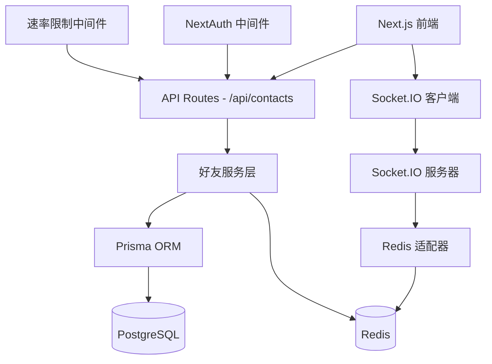
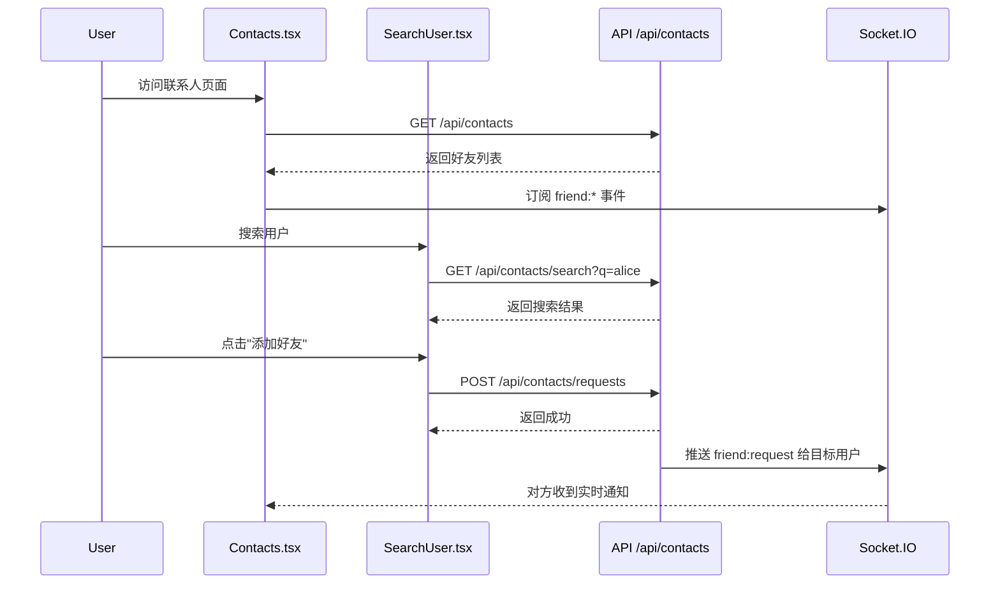

# user-relations - 技术设计规格

## 概述

本文档定义 Chat App 用户关系模块（好友系统）的技术实现设计。该模块基于现有的 NextAuth 认证系统、Socket.IO 实时通信基础设施和 Prisma ORM 数据访问层，提供好友请求、好友列表管理、拉黑和用户搜索功能。

## 架构设计

### 系统架构图



### 技术栈

- **前端**: React 19.1.1 + Next.js 15.5.3 App Router
- **后端**: Next.js API Routes + Node.js 20+
- **数据库**: PostgreSQL 12+ (通过 Prisma 6.16.2)
- **缓存**: Redis 6+ (用户在线状态 + Socket.IO 适配器)
- **实时通信**: Socket.IO 4.8.1
- **认证**: NextAuth.js 5.0.0-beta.29
- **验证**: Zod 4.1.9

---

## 数据模型设计

### Prisma Schema 定义

```prisma
// prisma/schema.prisma

model User {
  id                String            @id @default(cuid())
  email             String            @unique
  name              String?
  avatar            String?
  emailVerified     DateTime?
  createdAt         DateTime          @default(now())
  updatedAt         DateTime          @updatedAt
  
  // 好友关系（作为发起方）
  sentFriendRequests     FriendRelation[] @relation("SentRequests")
  receivedFriendRequests FriendRelation[] @relation("ReceivedRequests")
  
  // 拉黑关系（作为拉黑方）
  blockedUsers      BlockRelation[]  @relation("Blocker")
  blockedByUsers    BlockRelation[]  @relation("Blocked")
  
  // ... 其他已有字段
}

// 好友关系表（对称关系）
model FriendRelation {
  id         String   @id @default(cuid())
  status     FriendStatus @default(PENDING)
  
  // 请求发起方
  userId     String
  user       User     @relation("SentRequests", fields: [userId], references: [id], onDelete: Cascade)
  
  // 请求接收方
  friendId   String
  friend     User     @relation("ReceivedRequests", fields: [friendId], references: [id], onDelete: Cascade)
  
  createdAt  DateTime @default(now())
  updatedAt  DateTime @updatedAt
  
  // 唯一约束：一对用户只能有一个关系记录
  @@unique([userId, friendId])
  @@index([userId, status])
  @@index([friendId, status])
  @@map("friend_relations")
}

// 好友状态枚举
enum FriendStatus {
  PENDING   // 待处理
  ACCEPTED  // 已接受
  DECLINED  // 已拒绝（可选，可直接删除记录）
}

// 拉黑关系表（单向关系）
model BlockRelation {
  id         String   @id @default(cuid())
  
  // 拉黑方
  blockerId  String
  blocker    User     @relation("Blocker", fields: [blockerId], references: [id], onDelete: Cascade)
  
  // 被拉黑方
  blockedId  String
  blocked    User     @relation("Blocked", fields: [blockedId], references: [id], onDelete: Cascade)
  
  createdAt  DateTime @default(now())
  
  // 唯一约束：一对用户只能有一个拉黑记录
  @@unique([blockerId, blockedId])
  @@index([blockerId])
  @@index([blockedId])
  @@map("block_relations")
}
```

### 数据模型设计决策

#### 1. **好友关系存储策略：有向行 vs 无向行**

**选择**: 有向行（单向记录）

**理由**:
- 好友请求本身是有向操作（发起方 → 接收方）
- 状态管理更清晰（PENDING 只存在于请求记录中）
- 查询逻辑简单（通过 `userId` 和 `friendId` 明确角色）

**查询规范**:
```typescript
// 查询我的好友列表（我发起的 + 我接受的）
const myFriends = await prisma.friendRelation.findMany({
  where: {
    OR: [
      { userId: currentUserId, status: 'ACCEPTED' },
      { friendId: currentUserId, status: 'ACCEPTED' }
    ]
  }
});

// 查询我收到的待处理请求
const receivedRequests = await prisma.friendRelation.findMany({
  where: {
    friendId: currentUserId,
    status: 'PENDING'
  }
});

// 查询我发送的待处理请求
const sentRequests = await prisma.friendRelation.findMany({
  where: {
    userId: currentUserId,
    status: 'PENDING'
  }
});
```

#### 2. **拉黑关系独立表**

**理由**:
- 拉黑是单向关系，不需要双方确认
- 与好友关系解耦，便于独立管理
- 支持拉黑后解除好友关系的业务逻辑

#### 3. **索引策略**

```prisma
// 好友关系索引
@@unique([userId, friendId])        // 防止重复请求
@@index([userId, status])           // 查询我的好友/请求
@@index([friendId, status])         // 查询收到的请求

// 拉黑关系索引
@@unique([blockerId, blockedId])    // 防止重复拉黑
@@index([blockerId])                // 查询我拉黑的人
@@index([blockedId])                // 查询拉黑我的人（可选）
```

#### 4. **存储引擎**

- **数据库**: PostgreSQL 12+
- **事务支持**: 使用 Prisma 事务保证操作一致性
- **级联删除**: 用户删除时级联删除所有相关关系记录

---

## API 设计

### API 端点规范

#### 基础路径
```
/api/contacts/*
```

### 1. 发送好友请求

```http
POST /api/friends/requests
Content-Type: application/json
Authorization: NextAuth Session Cookie

{
  "friendId": "clyyy..."  // 目标用户 ID
}
```

**✅ 实现状态**: 已完成
- **文件**: `src/app/api/friends/requests/route.ts`, `service.ts`, `middleware.ts`
- **验证**: Zod schema (`sendFriendRequestApiSchema`)
- **业务逻辑**:
  1. 验证目标用户存在
  2. 检查是否为自己（不能添加自己）
  3. 检查双向拉黑关系
  4. 检查是否已存在好友关系或待处理请求
  5. 创建 FriendRelation 记录（status: PENDING）
  6. **Socket 推送**: `emitFriendRequest(io, friendId, payload)` → `friend:request:received` 事件

**响应**:
```json
{
  "success": true,
  "data": {
    "requestId": "clxxx...",
    "targetUser": {
      "id": "clyyy...",
      "email": "alice@example.com",
      "name": "Alice Smith",
      "image": "https://..."
    },
    "createdAt": "2025-09-29T12:00:00Z"
  }
}
```

**错误响应**:
```json
{
  "success": false,
  "error": {
    "code": "FRIEND_REQUEST_EXISTS",
    "message": "好友请求已存在"
  }
}
```

**Socket Payload** (推送给目标用户):
```typescript
{
  requestId: string;
  from: {
    id: string;
    email: string;
    name: string;
    avatar: string;
  };
  createdAt: string;
}
```

**错误码**:
- `USER_NOT_FOUND`: 目标用户不存在
- `CANNOT_ADD_SELF`: 不能添加自己
- `USER_BLOCKED`: 用户被拉黑或已拉黑对方
- `ALREADY_FRIEND`: 已经是好友
- `FRIEND_REQUEST_EXISTS`: 待处理请求已存在

---

### 2. 撤回好友请求

```http
DELETE /api/friends/requests/{requestId}
Authorization: NextAuth Session Cookie
```

**✅ 实现状态**: 已完成
- **文件**: `src/app/api/friends/requests/[requestId]/route.ts`, `service.ts`, `middleware.ts`
- **验证**: 路径参数 `requestId`
- **业务逻辑**:
  1. 查询 FriendRelation 记录
  2. 验证当前用户是发起方 (`userId === currentUserId`)
  3. 验证状态为 PENDING（已接受的无法撤回）
  4. 删除记录
  5. **Socket 推送**: `emitFriendDeclined(io, friendId, { requestId, userId })` → `friend:request:declined` 事件

**响应**:
```json
{
  "success": true,
  "message": "好友请求已撤回"
}
```

**Socket Payload** (推送给接收方):
```typescript
{
  requestId: string;
  userId: string;  // 撤回操作的发起方
}
```

**错误码**:
- `FRIEND_REQUEST_NOT_FOUND`: 请求不存在
- `UNAUTHORIZED`: 无权限撤回（不是发起方）
- `FRIEND_REQUEST_ALREADY_ACCEPTED`: 请求已被接受，无法撤回

---

### 3. 接受/拒绝好友请求

```http
PATCH /api/friends/requests/{requestId}
Content-Type: application/json
Authorization: NextAuth Session Cookie

{
  "action": "accept" // 或 "decline"
}
```

**✅ 实现状态**: 已完成
- **文件**: `src/app/api/friends/requests/[requestId]/route.ts`
- **服务函数**: `acceptFriendRequest()`, `declineFriendRequest()`
- **验证**: Zod schema (`respondToFriendRequestApiSchema`)

#### **接受请求流程**:
1. 查询 FriendRelation 记录
2. 验证当前用户是接收方 (`friendId === currentUserId`)
3. 验证状态为 PENDING
4. 更新状态为 ACCEPTED
5. 查询双方用户信息
6. **Socket 推送**: `emitFriendAccepted(io, userId, friendId, payloadForSender, payloadForReceiver)` → `friend:request:accepted` 事件（双向推送）

**响应（接受）**:
```json
{
  "success": true,
  "data": {
    "relationId": "clzzz...",
    "friend": {
      "id": "clxxx...",
      "email": "bob@example.com",
      "name": "Bob Johnson",
      "image": "https://...",
      "isOnline": true
    }
  }
}
```

#### **拒绝请求流程**:
1. 查询并验证权限（同上）
2. 删除 FriendRelation 记录
3. **Socket 推送**: `emitFriendDeclined(io, userId, payload)` → `friend:request:declined` 事件（单向推送给发起方）

**响应（拒绝）**:
```json
{
  "success": true,
  "message": "好友请求已拒绝"
}
```

**Socket Payload (接受时，双向)**:
```typescript
{
  relationId: string;
  friend: {
    id: string;
    email: string;
    name: string;
    image: string;
    isOnline: boolean;
  };
}
```

**Socket Payload (拒绝时，推送给发起方)**:
```typescript
{
  requestId: string;
  userId: string;  // 拒绝方的 ID
}
```

**错误码**:
- `FRIEND_REQUEST_NOT_FOUND`: 请求不存在
- `UNAUTHORIZED`: 无权限操作（不是接收方）
- `FRIEND_REQUEST_ALREADY_PROCESSED`: 请求已被处理

---

### 4. 获取好友列表

```http
GET /api/friends?status=ACCEPTED&limit=20&offset=0&sortBy=createdAt&order=desc
Authorization: NextAuth Session Cookie
```

**✅ 实现状态**: 已完成
- **文件**: `src/app/api/friends/route.ts`, `service.ts`, `middleware.ts`
- **服务函数**: `getFriendsList(userId, query)`
- **验证**: Zod schema (`getFriendsApiSchema`)

**业务逻辑**:
1. 双向关系查询：
   ```typescript
   where: {
     OR: [
       { userId: currentUserId, status: 'ACCEPTED' },
       { friendId: currentUserId, status: 'ACCEPTED' }
     ]
   }
   ```
2. 分页支持：`skip: offset, take: limit`
3. 排序支持：`orderBy: { [sortBy]: order }`
4. 返回 FriendRelation 记录（包含 user 和 friend 完整信息）

**响应**:
```json
{
  "success": true,
  "data": {
    "friends": [
      {
        "id": "clxxx...",
        "userId": "cluuu...",
        "friendId": "clvvv...",
        "status": "ACCEPTED",
        "createdAt": "2025-09-20T10:00:00Z",
        "updatedAt": "2025-09-20T10:00:00Z",
        "user": {
          "id": "cluuu...",
          "email": "me@example.com",
          "name": "My Name",
          "image": "https://..."
        },
        "friend": {
          "id": "clvvv...",
          "email": "alice@example.com",
          "name": "Alice Smith",
          "image": "https://..."
        }
      }
    ],
    "total": 45
  }
}
```

**查询参数**:
- `status`: 好友状态（`ACCEPTED` | `PENDING` | `DECLINED`，默认 `ACCEPTED`）
- `limit`: 每页条数（默认 20，最大 100）
- `offset`: 偏移量（默认 0）
- `sortBy`: 排序字段（`createdAt` | `updatedAt`，默认 `createdAt`）
- `order`: 排序方向（`asc` | `desc`，默认 `desc`）

**注意事项**:
- 返回的 `friends` 数组包含完整的 FriendRelation 记录
- 前端需要根据 `userId` 判断哪个是自己，哪个是好友
- 在线状态需要调用 `/api/friends/online-status` 批量查询

---

### 5. 获取待处理请求列表

```http
GET /api/friends/pending?type=received&limit=20&offset=0
Authorization: NextAuth Session Cookie
```

**✅ 实现状态**: 已完成
- **文件**: `src/app/api/friends/pending/route.ts`, `service.ts`, `middleware.ts`
- **服务函数**: `getPendingRequests(userId, type, query)`
- **验证**: Zod schema (`getPendingRequestsApiSchema`)

**业务逻辑**:
1. **type=received** (收到的请求):
   ```typescript
   where: { friendId: currentUserId, status: 'PENDING' }
   include: { user: true }  // 发起方信息
   ```
2. **type=sent** (发送的请求):
   ```typescript
   where: { userId: currentUserId, status: 'PENDING' }
   include: { friend: true }  // 接收方信息
   ```
3. 分页支持：`skip: offset, take: limit`
4. 按时间倒序：`orderBy: { createdAt: 'desc' }`

**响应**:
```json
{
  "success": true,
  "data": {
    "requests": [
      {
        "id": "clxxx...",
        "userId": "cluuu...",
        "friendId": "clvvv...",
        "status": "PENDING",
        "createdAt": "2025-09-29T11:30:00Z",
        "updatedAt": "2025-09-29T11:30:00Z",
        "user": {
          "id": "cluuu...",
          "email": "charlie@example.com",
          "name": "Charlie Brown",
          "image": "https://..."
        },
        "friend": {
          "id": "clvvv...",
          "email": "me@example.com",
          "name": "My Name",
          "image": "https://..."
        }
      }
    ],
    "total": 5
  }
}
```

**查询参数**:
- `type`: 请求类型（`received` | `sent`，默认 `received`）
- `limit`: 每页条数（默认 20，最大 100）
- `offset`: 偏移量（默认 0）

**前端使用提示**:
- `type=received`: 显示 `user` 字段（发起方）
- `type=sent`: 显示 `friend` 字段（接收方）

---

### 6. 删除好友

```http
DELETE /api/friends/{friendId}
Authorization: NextAuth Session Cookie
```

**✅ 实现状态**: 已完成
- **文件**: `src/app/api/friends/[friendId]/route.ts`, `service.ts`, `middleware.ts`
- **服务函数**: `removeFriend(userId, friendId)`
- **验证**: Zod schema (`removeFriendApiSchema`)

**业务逻辑**:
1. 双向关系查询：
   ```typescript
   where: {
     OR: [
       { userId: currentUserId, friendId, status: 'ACCEPTED' },
       { userId: friendId, friendId: currentUserId, status: 'ACCEPTED' }
     ]
   }
   ```
2. 验证好友关系存在
3. 删除 FriendRelation 记录
4. **Socket 推送**: `emitFriendRemoved(io, userId, friendId, payload)` → `friend:removed` 事件（双向推送）

**响应**:
```json
{
  "success": true,
  "message": "好友已删除"
}
```

**Socket Payload** (推送给双方):
```typescript
{
  userId: string;     // 发起删除操作的用户 ID
  friendId: string;   // 被删除的好友 ID
}
```

**错误码**:
- `FRIEND_NOT_FOUND`: 好友关系不存在
- `NOT_FRIENDS`: 不是好友关系（可能是 PENDING 状态）

**幂等性**: 重复删除已删除的好友返回 `FRIEND_NOT_FOUND` 错误

---

### 7. 拉黑/取消拉黑用户

#### 拉黑用户
```http
POST /api/friends/block/{userId}
Authorization: NextAuth Session Cookie
```

**✅ 实现状态**: 已完成
- **文件**: `src/app/api/friends/block/[userId]/route.ts`, `service.ts`, `middleware.ts`
- **服务函数**: `blockUser(currentUserId, targetUserId)`
- **验证**: Zod schema (`blockUserApiSchema`)

**业务逻辑**（使用 Prisma 事务）:
1. 验证不能拉黑自己
2. 检查是否已拉黑
3. **事务操作**:
   ```typescript
   await prisma.$transaction([
     // 1. 创建拉黑记录
     prisma.blockRelation.create({ blockerId, blockedId }),
     // 2. 删除已接受的好友关系（如果存在）
     prisma.friendRelation.deleteMany({
       OR: [
         { userId: blockerId, friendId: blockedId, status: 'ACCEPTED' },
         { userId: blockedId, friendId: blockerId, status: 'ACCEPTED' }
       ]
     }),
     // 3. 删除待处理请求（双向）
     prisma.friendRelation.deleteMany({
       OR: [
         { userId: blockerId, friendId: blockedId, status: 'PENDING' },
         { userId: blockedId, friendId: blockerId, status: 'PENDING' }
       ]
     })
   ])
   ```
4. **Socket 推送**: `emitFriendBlock(io, blockedId, { blockerId })` → `friend:blocked` 事件

**响应**:
```json
{
  "success": true,
  "message": "用户已拉黑"
}
```

**Socket Payload** (推送给被拉黑方):
```typescript
{
  blockerId: string;  // 拉黑操作的发起方
}
```

#### 取消拉黑
```http
DELETE /api/friends/block/{userId}
Authorization: NextAuth Session Cookie
```

**✅ 实现状态**: 已完成
- **服务函数**: `unblockUser(currentUserId, targetUserId)`

**业务逻辑**:
1. 查询 BlockRelation 记录
2. 验证存在拉黑关系
3. 删除 BlockRelation 记录
4. **Socket 推送**: `emitFriendUnblock(io, unblockedId, { blockerId })` → `friend:unblocked` 事件

**响应**:
```json
{
  "success": true,
  "message": "已取消拉黑"
}
```

**Socket Payload** (推送给被解除拉黑方):
```typescript
{
  blockerId: string;  // 取消拉黑操作的发起方
}
```

**错误码**:
- `CANNOT_BLOCK_SELF`: 不能拉黑自己
- `ALREADY_BLOCKED`: 已经拉黑该用户
- `BLOCK_NOT_FOUND`: 拉黑关系不存在

**副作用说明**:
- ✅ 拉黑时自动解除好友关系（使用事务保证一致性）
- ✅ 拉黑时删除双向待处理的好友请求
- ✅ 取消拉黑后，可以重新发送好友请求

---

### 8. 搜索用户

```http
GET /api/friends/search?q=alice&type=email&limit=10
Authorization: NextAuth Session Cookie
```

**✅ 实现状态**: 已完成
- **文件**: `src/app/api/friends/search/route.ts`, `service.ts`, `middleware.ts`
- **服务函数**: `searchUsers(currentUserId, query)`
- **验证**: Zod schema (`searchUserApiSchema`)
- **类型定义**: `src/types/friend/search-user.ts` (新增)

**业务逻辑**:
1. **type=email** (精确匹配):
   ```typescript
   where: {
     email: query.q,
     id: { not: currentUserId }  // 排除自己
   }
   ```
2. **type=name** (模糊匹配):
   ```typescript
   where: {
     name: { contains: query.q, mode: 'insensitive' },
     id: { not: currentUserId }
   }
   ```
3. 限制结果数量：`take: Math.min(query.limit || 10, 20)`
4. **附加关系状态**（查询 FriendRelation 和 BlockRelation）:
   - `none`: 无关系
   - `friend`: 已是好友
   - `pending_sent`: 我发送的待处理请求
   - `pending_received`: 收到的待处理请求
   - `blocked_by_me`: 我拉黑了对方
   - `blocked_by_them`: 对方拉黑了我

**响应**:
```json
{
  "success": true,
  "data": {
    "users": [
      {
        "id": "clxxx...",
        "email": "alice@example.com",
        "name": "Alice Smith",
        "image": "https://...",
        "relationStatus": "none"
      }
    ],
    "total": 1
  }
}
```

**查询参数**:
- `q`: 搜索关键词（必填，最少 1 字符）
- `type`: 搜索类型（`email` | `name`，默认 `email`）
- `limit`: 结果数量（默认 10，最大 20）

**RelationStatus 类型定义**:
```typescript
type RelationStatus = 
  | 'none'              // 无关系
  | 'friend'            // 已是好友
  | 'pending_sent'      // 我发送的待处理请求
  | 'pending_received'  // 收到的待处理请求
  | 'blocked_by_me'     // 我拉黑了对方
  | 'blocked_by_them';  // 对方拉黑了我
```

**前端使用示例**:
- `none`: 显示"添加好友"按钮
- `friend`: 显示"已是好友"
- `pending_sent`: 显示"撤回请求"
- `pending_received`: 显示"接受/拒绝"
- `blocked_by_me`: 显示"已拉黑"
- `blocked_by_them`: 显示"无法添加"或隐藏用户

---

### API 错误码规范

| 状态码 | 错误码 | 描述 |
|--------|--------|------|
| 400 | `INVALID_INPUT` | 输入参数验证失败 |
| 400 | `REQUEST_EXISTS` | 好友请求已存在 |
| 400 | `ALREADY_FRIEND` | 已是好友 |
| 400 | `CANNOT_ADD_SELF` | 不能添加自己为好友 |
| 400 | `USER_BLOCKED` | 用户已被拉黑 |
| 401 | `UNAUTHORIZED` | 未登录或会话过期 |
| 403 | `FORBIDDEN` | 无权限操作 |
| 404 | `NOT_FOUND` | 资源不存在 |
| 429 | `RATE_LIMIT_EXCEEDED` | 速率限制超出 |
| 500 | `INTERNAL_ERROR` | 服务器内部错误 |

---

## 实时事件设计

### Socket.IO 事件规范

#### 事件命名空间
```typescript
// 所有好友相关事件在默认命名空间 "/"
```

#### 事件类型定义

```typescript
// src/types/friend.ts

export interface ServerToClientEvents {
  // 收到好友请求
  'friend:request': (data: {
    requestId: string;
    from: {
      id: string;
      email: string;
      name: string;
      avatar: string;
    };
    createdAt: string;
  }) => void;
  
  // 好友请求被接受
  'friend:accepted': (data: {
    friend: {
      id: string;
      email: string;
      name: string;
      avatar: string;
      isOnline: boolean;
    };
    relationId: string;
  }) => void;
  
  // 好友请求被拒绝
  'friend:declined': (data: {
    requestId: string;
    userId: string; // 拒绝方的 ID
  }) => void;
  
  // 好友关系被删除
  'friend:removed': (data: {
    userId: string; // 删除操作发起方
    friendId: string; // 被删除的用户 ID
  }) => void;
  
  // 被拉黑
  'friend:block': (data: {
    blockerId: string;
  }) => void;
  
  // 好友上线
  'friend:online': (data: {
    userId: string;
  }) => void;
  
  // 好友下线
  'friend:offline': (data: {
    userId: string;
  }) => void;
}

export interface ClientToServerEvents {
  // 客户端无需主动发送好友事件，所有操作通过 API
}
```

#### 房间命名与订阅策略

```typescript
// 用户连接时自动加入个人房间
socket.join(`user:${userId}`);

// 事件推送示例
// 1. 发送好友请求 → 推送给接收方
io.to(`user:${friendId}`).emit('friend:request', payload);

// 2. 接受好友请求 → 推送给双方
io.to(`user:${userId}`).emit('friend:accepted', payloadForUser);
io.to(`user:${friendId}`).emit('friend:accepted', payloadForFriend);

// 3. 删除好友 → 推送给双方
io.to(`user:${userId}`).emit('friend:removed', payload);
io.to(`user:${friendId}`).emit('friend:removed', payload);
```

#### 鉴权策略

```typescript
// src/socket/server/middleware/auth.ts
// ✅ 已实现

import type { Socket } from 'socket.io';
import type { ClientToServerEvents, ServerToClientEvents, InterServerEvents, SocketData } from '@/types/socket';
import { logger } from '@/lib/logger';
import { getToken } from 'next-auth/jwt';

export async function authMiddleware(
  socket: Socket<ClientToServerEvents, ServerToClientEvents, InterServerEvents, SocketData>,
  next: (err?: Error) => void
) {
  try {
    const req = socket.request;
    const token = await getToken({
      req: { headers: req.headers as Record<string, string> },
      secret: process.env.AUTH_SECRET
    });
    
    if (!token) {
      logger.error('Socket auth failed: Invalid token', { socketId: socket.id });
      return next(new Error('Authentication failed: Invalid token'));
    }

    // 将用户信息附加到 socket.data
    socket.data.userId = token.userId as string;
    socket.data.username = token.name as string;
    socket.data.authenticated = true;
    
    // 自动将用户加入个人房间
    await socket.join(token.userId as string);
    
    next();
  } catch (error) {
    logger.error('Socket auth error', {
      socketId: socket.id,
      error: error instanceof Error ? error.message : 'Unknown error',
      stack: error instanceof Error ? error.stack : undefined,
    });
    next(new Error('Authentication failed: Invalid or expired token'));
  }
}
```

**实现亮点**:
- ✅ 从 Socket handshake 获取 NextAuth JWT token
- ✅ 验证 token 有效性
- ✅ 提取 userId 和 username 附加到 socket.data
- ✅ 自动将用户加入个人房间（userId）
- ✅ 未认证用户拒绝连接并返回清晰错误
- ✅ 完整的错误日志记录

#### Redis 适配器广播

```typescript
// src/socket/server/adapter.ts
// ✅ 已实现

import { createAdapter } from '@socket.io/redis-adapter';
import { createClient } from 'redis';

const pubClient = createClient({
  url: process.env.REDIS_URL || 'redis://localhost:6379',
});

const subClient = pubClient.duplicate();

export async function setupRedisAdapter(io: Server) {
  await Promise.all([pubClient.connect(), subClient.connect()]);
  io.adapter(createAdapter(pubClient, subClient));
}
```

```typescript
// src/lib/config/redis.ts
// ✅ 全局 Redis 单例配置

import { createClient } from 'redis';

const globalForRedis = globalThis as unknown as { redis?: ReturnType<typeof createClient> };

export const redis =
  globalForRedis.redis ??
  createClient({
    url: process.env.REDIS_URL || 'redis://localhost:6379',
  });

if (process.env.NODE_ENV !== 'production') globalForRedis.redis = redis;

let isConnected = false;

export const connectRedis = async () => {
  if (!isConnected) {
    await redis.connect();
    isConnected = true;
  }
};
```

**优势**:
- ✅ 支持多实例部署
- ✅ 事件可跨 Socket.IO 服务器实例广播
- ✅ 用户可连接到任意实例接收事件
- ✅ 全局 Redis 单例避免连接泄漏
- ✅ 开发环境复用全局连接

---

## 安全与配额设计

### 认证中间件

```typescript
// src/app/api/contacts/middleware.ts

import { NextRequest, NextResponse } from 'next/server';
import { getServerSession } from 'next-auth';
import { authOptions } from '@/lib/config/next.auth';

export async function withAuth(
  handler: (req: NextRequest, userId: string) => Promise<NextResponse>
) {
  return async (req: NextRequest) => {
    const session = await getServerSession(authOptions);
    
    if (!session?.user?.id) {
      return NextResponse.json(
        { success: false, error: { code: 'UNAUTHORIZED', message: '未登录' } },
        { status: 401 }
      );
    }
    
    return handler(req, session.user.id);
  };
}
```

### 速率限制中间件

```typescript
// src/app/api/contacts/rateLimit.ts

import { Redis } from 'ioredis';

const redis = new Redis(process.env.REDIS_URL);

interface RateLimitConfig {
  maxRequests: number;
  windowMs: number;
}

export async function rateLimit(
  userId: string,
  action: string,
  config: RateLimitConfig
): Promise<{ allowed: boolean; remaining: number }> {
  const key = `ratelimit:${action}:${userId}`;
  const now = Date.now();
  const windowStart = now - config.windowMs;
  
  // 使用 Redis Sorted Set 存储请求时间戳
  await redis.zremrangebyscore(key, 0, windowStart);
  const count = await redis.zcard(key);
  
  if (count >= config.maxRequests) {
    return { allowed: false, remaining: 0 };
  }
  
  await redis.zadd(key, now, `${now}`);
  await redis.expire(key, Math.ceil(config.windowMs / 1000));
  
  return { allowed: true, remaining: config.maxRequests - count - 1 };
}

// 使用示例
const { allowed, remaining } = await rateLimit(userId, 'send_friend_request', {
  maxRequests: 10,
  windowMs: 60000 // 1 分钟
});

if (!allowed) {
  return NextResponse.json(
    { success: false, error: { code: 'RATE_LIMIT_EXCEEDED', message: '请求过于频繁' } },
    { status: 429, headers: { 'X-RateLimit-Remaining': '0' } }
  );
}
```

### 速率限制配置

| 操作 | 限制 | 时间窗口 |
|------|------|----------|
| 发送好友请求 | 10 次 | 1 分钟 |
| 接受/拒绝请求 | 20 次 | 1 分钟 |
| 搜索用户 | 5 次 | 10 秒 |
| 删除好友 | 10 次 | 1 分钟 |
| 拉黑用户 | 5 次 | 1 分钟 |

### 审计日志

```typescript
// src/lib/audit.ts

import { prisma } from '@/lib/config/prisma';

interface AuditLogEntry {
  userId: string;
  action: string;
  targetUserId?: string;
  metadata?: Record<string, any>;
  ipAddress?: string;
  userAgent?: string;
}

export async function logAudit(entry: AuditLogEntry): Promise<void> {
  await prisma.auditLog.create({
    data: {
      userId: entry.userId,
      action: entry.action,
      targetUserId: entry.targetUserId,
      metadata: entry.metadata,
      ipAddress: entry.ipAddress,
      userAgent: entry.userAgent,
      createdAt: new Date()
    }
  });
}

// 使用示例
await logAudit({
  userId: currentUserId,
  action: 'FRIEND_REQUEST_SENT',
  targetUserId: targetUserId,
  metadata: { requestId },
  ipAddress: req.headers.get('x-forwarded-for') || req.ip,
  userAgent: req.headers.get('user-agent')
});
```

**审计日志字段**:
- `userId`: 操作发起者
- `action`: 操作类型（`FRIEND_REQUEST_SENT`, `FRIEND_ACCEPTED`, `FRIEND_REMOVED`, `USER_BLOCKED` 等）
- `targetUserId`: 操作目标用户
- `metadata`: 操作元数据（JSON）
- `ipAddress`: 客户端 IP
- `userAgent`: 客户端 User-Agent
- `createdAt`: 操作时间

---

## 前端结构设计

### 页面路由

```
src/app/(dashboard)/contacts/page.tsx
```

### 组件层次结构

```
src/components/
├── pages/
│   └── Contacts.tsx                    # 联系人页面主组件
├── contacts/
│   ├── FriendList.tsx                  # 好友列表组件
│   ├── FriendListItem.tsx              # 好友列表项
│   ├── FriendRequest.tsx               # 好友请求卡片
│   ├── PendingRequestsList.tsx         # 待处理请求列表
│   ├── SearchUser.tsx                  # 用户搜索组件
│   ├── UserSearchResult.tsx            # 搜索结果项
│   ├── BlockList.tsx                   # 黑名单列表
│   └── OnlineStatusBadge.tsx           # 在线状态标识
└── ui/
    └── [现有 shadcn/ui 组件]
```

### 组件交互流程



### 状态管理

#### 在线状态（只读）

```typescript
// src/hooks/useOnlineStatus.ts

import { useEffect, useState } from 'react';
import { socket } from '@/socket/client';

export function useOnlineStatus(userIds: string[]) {
  const [onlineStatus, setOnlineStatus] = useState<Record<string, boolean>>({});
  
  useEffect(() => {
    // 初始化时从服务器获取状态
    fetch('/api/contacts/online-status', {
      method: 'POST',
      body: JSON.stringify({ userIds })
    })
      .then(res => res.json())
      .then(data => setOnlineStatus(data.statuses));
    
    // 监听实时状态更新
    socket.on('friend:online', ({ userId }) => {
      setOnlineStatus(prev => ({ ...prev, [userId]: true }));
    });
    
    socket.on('friend:offline', ({ userId }) => {
      setOnlineStatus(prev => ({ ...prev, [userId]: false }));
    });
    
    return () => {
      socket.off('friend:online');
      socket.off('friend:offline');
    };
  }, [userIds]);
  
  return onlineStatus;
}
```

#### 好友列表状态

```typescript
// src/hooks/useFriendsList.ts

import { useEffect, useState } from 'react';
import { socket } from '@/socket/client';

interface Friend {
  id: string;
  email: string;
  name: string;
  avatar: string;
  isOnline: boolean;
  friendSince: string;
}

export function useFriendsList() {
  const [friends, setFriends] = useState<Friend[]>([]);
  const [loading, setLoading] = useState(true);
  
  useEffect(() => {
    // 加载好友列表
    fetch('/api/contacts')
      .then(res => res.json())
      .then(data => {
        setFriends(data.data.friends);
        setLoading(false);
      });
    
    // 监听好友添加事件
    socket.on('friend:accepted', ({ friend }) => {
      setFriends(prev => [friend, ...prev]);
    });
    
    // 监听好友删除事件
    socket.on('friend:removed', ({ friendId }) => {
      setFriends(prev => prev.filter(f => f.id !== friendId));
    });
    
    return () => {
      socket.off('friend:accepted');
      socket.off('friend:removed');
    };
  }, []);
  
  return { friends, loading };
}
```

### UI/UX 规范

#### 空状态

```tsx
// 好友列表为空
<div className="text-center py-12">
  <UsersIcon className="w-16 h-16 mx-auto text-gray-400" />
  <h3 className="mt-4 text-lg font-medium">暂无好友</h3>
  <p className="mt-2 text-sm text-gray-500">搜索用户并添加为好友</p>
  <Button className="mt-4" onClick={() => setShowSearch(true)}>
    搜索用户
  </Button>
</div>
```

#### 加载状态

```tsx
// 使用 skeleton 占位符
<div className="space-y-4">
  {[1, 2, 3].map(i => (
    <Skeleton key={i} className="h-16 w-full" />
  ))}
</div>
```

#### 错误处理

```tsx
// 使用 toast 提示
import { toast } from 'sonner';

try {
  await sendFriendRequest(userId);
  toast.success('好友请求已发送');
} catch (error) {
  toast.error(error.message || '操作失败，请稍后重试');
}
```

---

## 数据库迁移策略

### 迁移脚本生成

```bash
# 生成迁移脚本（仅文档，不执行）
npx prisma migrate dev --name add_friend_relations --create-only
```

### 迁移 SQL 预览

```sql
-- CreateEnum
CREATE TYPE "FriendStatus" AS ENUM ('PENDING', 'ACCEPTED', 'DECLINED');

-- CreateTable
CREATE TABLE "friend_relations" (
    "id" TEXT NOT NULL,
    "status" "FriendStatus" NOT NULL DEFAULT 'PENDING',
    "userId" TEXT NOT NULL,
    "friendId" TEXT NOT NULL,
    "createdAt" TIMESTAMP(3) NOT NULL DEFAULT CURRENT_TIMESTAMP,
    "updatedAt" TIMESTAMP(3) NOT NULL,

    CONSTRAINT "friend_relations_pkey" PRIMARY KEY ("id")
);

-- CreateTable
CREATE TABLE "block_relations" (
    "id" TEXT NOT NULL,
    "blockerId" TEXT NOT NULL,
    "blockedId" TEXT NOT NULL,
    "createdAt" TIMESTAMP(3) NOT NULL DEFAULT CURRENT_TIMESTAMP,

    CONSTRAINT "block_relations_pkey" PRIMARY KEY ("id")
);

-- CreateIndex
CREATE INDEX "friend_relations_userId_status_idx" ON "friend_relations"("userId", "status");

-- CreateIndex
CREATE INDEX "friend_relations_friendId_status_idx" ON "friend_relations"("friendId", "status");

-- CreateIndex
CREATE UNIQUE INDEX "friend_relations_userId_friendId_key" ON "friend_relations"("userId", "friendId");

-- CreateIndex
CREATE INDEX "block_relations_blockerId_idx" ON "block_relations"("blockerId");

-- CreateIndex
CREATE INDEX "block_relations_blockedId_idx" ON "block_relations"("blockedId");

-- CreateIndex
CREATE UNIQUE INDEX "block_relations_blockerId_blockedId_key" ON "block_relations"("blockerId", "blockedId");

-- AddForeignKey
ALTER TABLE "friend_relations" ADD CONSTRAINT "friend_relations_userId_fkey" FOREIGN KEY ("userId") REFERENCES "User"("id") ON DELETE CASCADE ON UPDATE CASCADE;

-- AddForeignKey
ALTER TABLE "friend_relations" ADD CONSTRAINT "friend_relations_friendId_fkey" FOREIGN KEY ("friendId") REFERENCES "User"("id") ON DELETE CASCADE ON UPDATE CASCADE;

-- AddForeignKey
ALTER TABLE "block_relations" ADD CONSTRAINT "block_relations_blockerId_fkey" FOREIGN KEY ("blockerId") REFERENCES "User"("id") ON DELETE CASCADE ON UPDATE CASCADE;

-- AddForeignKey
ALTER TABLE "block_relations" ADD CONSTRAINT "block_relations_blockedId_fkey" FOREIGN KEY ("blockedId") REFERENCES "User"("id") ON DELETE CASCADE ON UPDATE CASCADE;
```

### 回滚策略

```sql
-- DropTable
DROP TABLE "friend_relations";
DROP TABLE "block_relations";

-- DropEnum
DROP TYPE "FriendStatus";
```

### 数据迁移注意事项

1. **仅文档化，不执行迁移**：本规格阶段仅生成迁移脚本，不执行 `prisma migrate deploy`
2. **审核迁移脚本**：由团队审核生成的 SQL 脚本
3. **测试环境验证**：在测试数据库先执行迁移
4. **生产部署计划**：制定生产环境迁移计划和回滚方案

---

## 性能优化设计

### 查询优化

#### 1. **好友列表分页**

```typescript
// 使用游标分页而非偏移分页
const friends = await prisma.friendRelation.findMany({
  where: {
    OR: [
      { userId: currentUserId, status: 'ACCEPTED' },
      { friendId: currentUserId, status: 'ACCEPTED' }
    ]
  },
  take: limit,
  skip: (page - 1) * limit,
  orderBy: { createdAt: 'desc' },
  include: {
    user: { select: { id: true, email: true, name: true, avatar: true } },
    friend: { select: { id: true, email: true, name: true, avatar: true } }
  }
});
```

#### 2. **在线状态批量查询**

```typescript
// ✅ 已实现 - src/app/api/friends/online-status/service.ts

// 使用 Redis MGET 批量获取状态（最多 100 用户）
await connectRedis();
const keys = userIds.map(id => `user:online:${id}`);
const statuses = await redis.mGet(keys);

const onlineStatus = Object.fromEntries(
  userIds.map((id, i) => [id, statuses[i] === '1'])
);
```

#### 3. **数据库索引覆盖**

```prisma
// 确保查询使用索引
@@index([userId, status])  // 覆盖 "我的好友" 查询
@@index([friendId, status]) // 覆盖 "收到的请求" 查询
```

### 缓存策略

#### 1. **好友列表缓存**

```typescript
// 暂未实现缓存层，直接从数据库查询
// 未来优化：可添加 Redis 缓存好友 ID 列表（30 分钟 TTL）
const cacheKey = `friends:${userId}`;
let friendIds = await redis.get(cacheKey);

if (!friendIds) {
  friendIds = await fetchFriendIdsFromDb(userId);
  await redis.set(cacheKey, JSON.stringify(friendIds), { EX: 1800 });
}
```

#### 2. **在线状态缓存**

```typescript
// ✅ 已实现 - src/socket/server/events/connection/connection.ts

// 用户上线时设置状态（1小时过期）
await connectRedis();
await redis.set(`user:online:${userId}`, '1', { EX: 3600 });

// 用户下线时删除状态
await connectRedis();
await redis.del(`user:online:${userId}`);
```

### 实时通信优化

#### 1. **房间订阅优化**

```typescript
// 只订阅好友的状态变更，不订阅全局
socket.join(`user:${userId}`); // 个人房间
socket.join(`friends:${userId}`); // 好友动态房间
```

#### 2. **事件批量推送**

```typescript
// 批量推送状态变更
const friendIds = await getFriendIds(userId);
friendIds.forEach(friendId => {
  io.to(`user:${friendId}`).emit('friend:online', { userId });
});
```

---

## 测试策略

### 单元测试

- **服务层测试**: 测试好友关系业务逻辑
- **工具函数测试**: 测试验证函数、速率限制逻辑
- **数据模型测试**: 测试 Prisma 查询逻辑

### 集成测试

- **API 端点测试**: 测试所有 REST API 端点
- **Socket 事件测试**: 测试实时事件推送
- **数据库事务测试**: 测试并发操作一致性

### 端到端测试

- **好友请求流程**: 发送 → 接受 → 验证双方好友列表
- **拉黑流程**: 拉黑 → 验证好友关系解除
- **并发操作**: 测试同时发送多个请求的幂等性

### 性能测试

- **并发请求**: 100 个用户同时发送好友请求
- **大列表加载**: 1000 个好友的分页性能
- **实时推送**: 1000 个在线用户的状态广播延迟

---

## SLO 与观测性

### 服务水平目标（SLO）

| 指标 | 目标 | 测量方法 |
|------|------|----------|
| API 响应时间 | P95 < 500ms | 应用性能监控（APM） |
| 实时事件延迟 | P95 < 200ms | Socket.IO 事件时间戳 |
| 好友列表加载 | P95 < 300ms | 前端性能监控 |
| 搜索响应时间 | P95 < 200ms | API 日志统计 |
| 事件送达率 | > 99.5% | Socket.IO 确认机制 |

### 观测性埋点

#### 1. **API 指标**

```typescript
// 记录 API 响应时间
const startTime = Date.now();
const result = await handleRequest(req);
const duration = Date.now() - startTime;

logger.info('API request', {
  endpoint: '/api/contacts/requests',
  method: 'POST',
  userId: session.user.id,
  duration,
  status: result.status
});
```

#### 2. **业务指标**

```typescript
// 记录业务事件
await logMetric('friend_request_sent', {
  userId: currentUserId,
  targetUserId,
  timestamp: new Date()
});

await logMetric('friend_request_accepted', {
  userId: currentUserId,
  requesterId,
  timestamp: new Date()
});
```

#### 3. **实时事件指标**

```typescript
// Socket.IO 事件监控
io.on('connection', (socket) => {
  logger.info('Socket connected', {
    userId: socket.data.userId,
    socketId: socket.id
  });
  
  socket.on('disconnect', () => {
    logger.info('Socket disconnected', {
      userId: socket.data.userId,
      socketId: socket.id,
      duration: Date.now() - socket.handshake.time
    });
  });
});
```

---

## Evidence（证据来源）

### 现有技术基础设施

- **认证系统**: `src/lib/config/next.auth.ts` (NextAuth 配置)
- **Socket.IO 服务器**: `src/socket/server/config.ts`, `src/socket/server/adapter.ts`
- **Socket 中间件**: 
  - `src/socket/server/middleware/logging.ts` (日志中间件)
  - `src/socket/server/middleware/auth.ts` (✅ 认证中间件 - 已实现)
- **Socket 事件处理**: `src/socket/server/events/friend/` (✅ 6个处理器 - 已实现)
- **在线状态管理**: `src/socket/server/events/connection/connection.ts` (✅ 已实现)
- **Prisma 配置**: `prisma/schema.prisma`, `src/lib/config/prisma.ts`
- **Redis 配置**: 
  - `src/socket/server/adapter.ts` (Redis 集群支持)
  - `src/lib/config/redis.ts` (✅ 全局单例 - 已实现)

### 规划路径（来自 structure.md）

- **前端页面**: `src/app/(dashboard)/contacts/page.tsx` (第115行规划)
- **前端组件**: `src/components/pages/Contacts.tsx` (第117行规划)
- **后端 API**: `src/app/api/contacts/route.ts` (第500行规划)
- **类型定义**: `src/types/friend.ts` (新增)

### 技术栈版本（来自 tech.md）

- **Next.js**: 15.5.3 (第18行)
- **Socket.IO**: 4.8.1 (第39行)
- **Prisma**: 6.16.2 (第45行)
- **PostgreSQL**: 12+ (第48行)
- **Redis**: 5.8.2 (第49行)
- **NextAuth.js**: 5.0.0-beta.29 (第33行)

### 数据库规划（来自 tech.md）

- **数据存储架构**: 第97-103行提到"好友关系"模型
- **PostgreSQL 存储**: 用户账户、好友关系、群组信息（第99行）

### 中间件路线图（来自 tech.md）

- **速率限制中间件**: 第329-332行规划扩展到联系人 API
- **审计日志**: 第334-337行规划补充审计与观测埋点

---

**文档版本**: 1.2  
**创建日期**: 2025-09-29  
**最后更新**: 2025-10-02  
**状态**: 实施中（13/19 任务完成 - 后端完成，前端基础就绪）

**实施进度摘要**:
- ✅ **数据层和类型层** (Tasks 1-2): 完成
  - ✅ Prisma schema (FriendRelation, BlockRelation)
  - ✅ TypeScript types (`src/types/friend/`)
  
- ✅ **API 层** (Tasks 3-10): 完成 - 10个端点
  - ✅ 好友请求发送 (POST /api/friends/requests)
  - ✅ 好友请求响应 (PATCH/DELETE /api/friends/requests/[id])
  - ✅ 好友列表查询 (GET /api/friends)
  - ✅ 待处理请求查询 (GET /api/friends/pending)
  - ✅ 好友删除 (DELETE /api/friends/[friendId])
  - ✅ 拉黑管理 (POST/DELETE /api/friends/block/[userId])
  - ✅ 黑名单查询 (GET /api/friends/block)
  - ✅ 用户搜索 (GET /api/friends/search)
  - ✅ 在线状态查询 (POST /api/friends/online-status)
  
- ✅ **Socket.IO 实时通信层** (Tasks 11-12): 完成
  - ✅ NextAuth JWT 认证中间件 (`src/socket/server/middleware/auth.ts`)
  - ✅ 8个事件处理器：
    - friend:request:received (request.ts)
    - friend:request:accepted (accept.ts)
    - friend:request:declined (decline.ts)
    - friend:removed (remove.ts)
    - friend:blocked (block.ts)
    - friend:unblocked (unblock.ts)
    - friend:online (connection.ts)
    - friend:offline (connection.ts)
  - ✅ Redis 在线状态管理 (`src/socket/server/events/connection/connection.ts`)
  - ✅ Redis 全局单例配置 (`src/lib/config/redis.ts`)
  
- ✅ **前端基础页面** (Task 14): 完成
  - ✅ `src/app/(dashboard)/friends/page.tsx`
  - ✅ `src/components/pages/Friends.tsx` (4个 Tab: 好友列表、待处理请求、搜索用户、黑名单)
  - ✅ 空状态展示和引导
  
- ❌ **前端 API 管理器** (Task 13): 待实现
  - ❌ `src/lib/api/friends.ts` (FriendsApiManager 类)
  - 优先级：高（阻塞 Task 18）
  
- ❌ **前端组件** (Tasks 15-17): 待实现
  - ❌ 好友列表组件 (FriendList, FriendListItem, OnlineStatusBadge)
  - ❌ 待处理请求组件 (PendingRequestsList, FriendRequest)
  - ❌ 搜索和黑名单组件 (SearchUser, UserSearchResult, BlockList)
  
- ❌ **前端 Hooks** (Task 18): 待实现（依赖 Task 13）
  - ❌ useFriendsList, usePendingRequests, useOnlineStatus, useSearchUsers
  
- ❌ **测试和优化** (Task 19): 待实现

**关键架构决策**:
1. ✅ API 架构遵循认证模块模式：route.ts + service.ts + middleware.ts
2. ✅ 服务层使用独立函数，不使用类（与认证模块一致）
3. ✅ 每个 service.ts 初始化自己的 Prisma 客户端
4. ✅ Socket.IO 使用 NextAuth JWT token 认证
5. ✅ Redis 全局单例与 Prisma 架构完全一致
6. ✅ 所有 Socket 事件在 API 成功响应后推送（数据库操作完成后）
7. ✅ 双向关系查询使用 OR 条件（userId/friendId 互换）
8. ✅ 拉黑操作使用 Prisma 事务保证级联删除一致性
