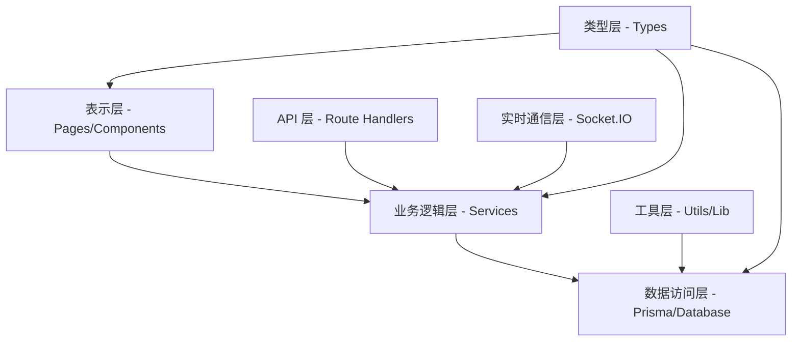

# Chat App - 项目结构

## 仓库顶层目录结构

```
chatapp/                           # 项目根目录
├── .spec-workflow/                # 规格工作流管理目录
│   ├── approvals/                 # 审批流程记录
│   ├── archive/                   # 历史文档归档
│   ├── specs/                     # 功能规格文档
│   ├── steering/                  # 项目指导文档
│   ├── templates/                 # 文档模板
│   └── user-templates/            # 用户自定义模板
├── prisma/                        # 数据库相关
│   ├── migrations/                # 数据库迁移文件
│   └── schema.prisma              # 数据模型定义
├── public/                        # 静态资源文件
├── src/                           # 源代码目录
│   ├── app/                       # Next.js App Router 应用目录
│   ├── components/                # React 组件库
│   ├── hooks/                     # 自定义 React Hooks
│   ├── lib/                       # 工具库和配置
│   ├── socket/                    # Socket.IO 实时通信
│   ├── types/                     # TypeScript 类型定义
│   └── server.ts                  # 自定义服务器入口
├── types/                         # 全局类型定义
├── docker-compose.yml             # 开发环境容器编排
├── Dockerfile                     # 应用容器化配置
├── package.json                   # NPM 依赖和脚本配置
├── tsconfig.json                  # TypeScript 编译配置
├── next.config.ts                 # Next.js 框架配置
├── tailwind.config.js             # Tailwind CSS 配置
└── README.md                      # 项目说明文档
```

## 应用模块划分

### 1. 认证模块 (Authentication)
**职责**: 用户身份验证和会话管理
**核心路径**:
```
src/app/(auth)/                    # 认证相关页面
├── login/page.tsx                 # 登录页面
├── register/page.tsx              # 注册页面
├── forgot-password/page.tsx       # 忘记密码页面
└── [token]/reset-password/page.tsx # 重置密码页面

src/app/api/auth/                  # 认证 API 端点
├── login/                         # 登录 API
├── register/                      # 注册 API
├── forgot-password/               # 忘记密码 API
├── reset-password/                # 重置密码 API
└── [...nextauth]/route.ts         # NextAuth.js 统一端点

src/lib/config/                    # 认证配置
├── next.auth.ts                   # NextAuth.js 配置
└── prisma.ts                      # 数据库连接配置

src/lib/                           # 认证工具库
├── crypto.ts                      # 密码加密/验证
└── email.ts                       # 邮件发送服务
```

### 2. 实时通信模块 (Real-time Communication)
**职责**: 实时事件传输、连接管理和基础设施
**核心路径**:
```
src/socket/                        # Socket.IO 实现
├── client/                        # 客户端实现
│   ├── config.ts                  # 客户端配置和连接函数
│   ├── index.ts                   # 客户端主入口
│   └── provider.tsx               # React Context Provider (会话集成)
├── server/                        # 服务器端实现
│   ├── config.ts                  # 服务器配置和初始化
│   ├── adapter.ts                 # Redis 适配器配置
│   ├── middleware/                # Socket 中间件目录
│   │   ├── index.ts               # 中间件导出
│   │   └── logging.ts             # 事件日志中间件
│   └── events/                    # 事件处理器
│       ├── connection/            # 连接管理事件
│       │   ├── connection.ts      # 连接处理器
│       │   └── index.ts           # 连接事件导出
│       ├── remote/                # 远程控制事件
│       │   ├── tap.ts             # 点击事件处理
│       │   └── index.ts           # 远程事件导出
│       └── index.ts               # 事件处理器总导出
└── index.ts                       # Socket 模块主入口
```

### 3. 远程控制模块 (Remote Control)
**职责**: 远程交互事件处理和界面
**核心路径**:
```
src/app/(dashboard)/remote-control/page.tsx  # 远程控制页面
src/components/pages/RemoteControl.tsx       # 远程控制组件
src/socket/server/events/remote/tap.ts       # 点击事件处理逻辑
```

### 4. 聊天业务模块 (Chat Business) - 🚧 计划中
**职责**: 聊天功能的业务逻辑和用户界面 (尚未实现)
**计划路径**:
```
src/app/(dashboard)/chat/page.tsx            # 主聊天页面 (当前仅占位符)
src/components/pages/Chat.tsx                # 聊天组件 (当前仅占位符)
src/socket/server/events/chat/               # 聊天事件处理 (计划中)
├── message.ts                               # 消息发送/接收处理
├── room.ts                                  # 聊天室管理
└── typing.ts                                # 打字状态处理
```

### 5. 用户关系模块 (User Relations) - 🚧 进行中
**职责**: 好友系统、群组管理和用户状态
**状态**: 规格文档已完成，后端完成，前端基础就绪 (13/19 任务完成，68.4%)
**当前路径**:

#### 数据层 (✅ 已完成)
```
prisma/schema.prisma                         # FriendRelation, BlockRelation 模型（✅ 已实现）
prisma/migrations/20250930105436_add_friend_relations/  # 迁移文件（✅ 已应用）
src/types/friend.ts                          # 好友关系类型定义（✅ 已实现）
src/types/socket.ts                          # Socket.IO 好友事件类型（✅ 已扩展）
```

#### 服务层 (✅ 已完成 - 按认证模块架构)
```
# 注：按照认证模块架构，服务逻辑分散在各 API 路由的 service.ts 中
src/app/api/friends/service.ts                        # 好友列表服务（✅ 已实现）
src/app/api/friends/requests/service.ts               # 发送请求服务（✅ 已实现）
src/app/api/friends/requests/[requestId]/service.ts   # 响应/撤回请求服务（✅ 已实现）
src/app/api/friends/pending/service.ts                # 待处理请求服务（✅ 已实现）
src/app/api/friends/[friendId]/service.ts             # 删除好友服务（✅ 已实现）
src/app/api/friends/block/service.ts                  # 黑名单列表服务（✅ 已实现）
src/app/api/friends/block/[userId]/service.ts         # 拉黑/取消拉黑服务（✅ 已实现）
src/app/api/friends/search/service.ts                 # 用户搜索服务（✅ 已实现）
src/app/api/friends/online-status/service.ts          # 在线状态查询服务（✅ 已实现）
src/lib/rateLimit.ts                                  # 速率限制工具（📋 待实施）
src/lib/audit.ts                                      # 审计日志工具（📋 待实施）
```

#### API 层 (✅ 已完成 - 10个端点)
```
# 按照认证模块架构，每个路由包含 route.ts, service.ts, middleware.ts
src/app/api/friends/                                   # 好友 API 目录
├── route.ts + service.ts + middleware.ts              # GET 好友列表（✅ 已实现）
├── requests/
│   ├── route.ts + service.ts + middleware.ts          # POST 发送请求（✅ 已实现）
│   └── [requestId]/
│       └── route.ts + service.ts + middleware.ts      # PATCH 接受/拒绝, DELETE 撤回（✅ 已实现）
├── pending/
│   └── route.ts + service.ts + middleware.ts          # GET 待处理请求（✅ 已实现）
├── [friendId]/
│   └── route.ts + service.ts + middleware.ts          # DELETE 删除好友（✅ 已实现）
├── block/
│   ├── route.ts + service.ts + middleware.ts          # GET 黑名单列表（✅ 已实现）
│   └── [userId]/
│       └── route.ts + service.ts + middleware.ts      # POST 拉黑, DELETE 取消拉黑（✅ 已实现）
├── search/
│   └── route.ts + service.ts + middleware.ts          # GET 搜索用户（✅ 已实现）
└── online-status/
    └── route.ts + service.ts + middleware.ts          # POST 批量查询在线状态（✅ 已实现）

# 实现亮点：
# - 所有端点遵循认证模块的三文件架构（route.ts + service.ts + middleware.ts）
# - 使用 Zod schemas 进行输入验证
# - 拉黑功能使用 Prisma 事务确保级联删除一致性
# - 用户搜索支持邮箱精确匹配和昵称模糊搜索，并标注关系状态
# - 在线状态查询使用 Redis MGET 批量操作（最多 100 用户）
# - 所有双向关系查询（好友、拉黑）使用 OR 条件确保完整性
```

#### 实时通信层 (✅ 已完成)
```
src/socket/server/middleware/auth.ts         # Socket 认证中间件（✅ 已实现）
src/socket/server/events/friend/             # 好友事件处理器目录（✅ 已实现）
├── index.ts                                 # 好友事件导出（✅ 已实现）
├── request.ts                               # emitFriendRequest（✅ 已实现）
├── accept.ts                                # emitFriendAccepted（✅ 已实现）
├── decline.ts                               # emitFriendDeclined（✅ 已实现）
├── remove.ts                                # emitFriendRemoved（✅ 已实现）
├── block.ts                                 # emitFriendBlock（✅ 已实现）
└── unblock.ts                               # emitFriendUnblock（✅ 已实现）
src/socket/server/events/connection/connection.ts  # 在线状态管理（✅ 已实现）
src/lib/config/redis.ts                      # Redis 全局客户端（✅ 已实现）

# 实现亮点：
# - Socket 认证从 NextAuth JWT token 获取用户信息
# - 自动将用户加入个人房间（userId）
# - 连接时设置 Redis 在线状态并通知所有好友
# - 断开时删除 Redis 状态并通知所有好友（包含 lastSeen）
# - 所有 API 端点已集成 Socket 事件推送
```

#### 前端层 (⏳ 部分完成)
```
# 页面层（✅ 已完成）
src/app/(dashboard)/friends/page.tsx         # 好友管理页面（✅ 已实现，Task 14）
src/components/pages/Friends.tsx             # 好友主组件（✅ 已实现，Task 14）
  # ✅ 已完成：4个 Tab（好友列表、待处理请求、搜索用户、黑名单）
  # ✅ 已完成：空状态展示和引导
  # ✅ 已完成：基础布局和导航
  
# API 管理层（❌ 待实施，优先级高）
src/lib/api/friends.ts                       # FriendsApiManager 类（❌ 待实施，Task 13）
  # 📋 待实现：12个 API 方法（getFriendsList, sendFriendRequest, acceptFriendRequest, 
  #            declineFriendRequest, cancelFriendRequest, getPendingRequests, removeFriend,
  #            blockUser, unblockUser, getBlockList, searchUsers, getOnlineStatus）
  # 📋 继承 BaseApiManager（参考 AuthApiManager 实现）
  # 📋 导出单例：export const friendsApi = new FriendsApiManager()
  # 注：Task 18 的 Hooks 依赖此文件
  
# 组件层（❌ 待实施）
src/components/friends/                      # 好友组件目录（📋 待创建）
├── FriendList.tsx                           # 好友列表（❌ Task 15）
├── FriendListItem.tsx                       # 好友列表项（❌ Task 15）
├── OnlineStatusBadge.tsx                    # 在线状态标识（❌ Task 15）
├── PendingRequestsList.tsx                  # 待处理请求列表（❌ Task 16）
├── FriendRequest.tsx                        # 好友请求卡片（❌ Task 16）
├── SearchUser.tsx                           # 用户搜索（❌ Task 17）
├── UserSearchResult.tsx                     # 搜索结果项（❌ Task 17）
└── BlockList.tsx                            # 黑名单列表（❌ Task 17）

# Hooks 层（❌ 待实施，依赖 Task 13）
src/hooks/                                   # 自定义 Hooks
├── useFriendsList.ts                        # 好友列表 Hook（❌ Task 18，依赖 friendsApi）
├── usePendingRequests.ts                    # 待处理请求 Hook（❌ Task 18，依赖 friendsApi）
├── useOnlineStatus.ts                       # 在线状态 Hook（❌ Task 18，依赖 friendsApi）
├── useSearchUsers.ts                        # 搜索用户 Hook（❌ Task 18，依赖 friendsApi）
├── useForm.ts                               # 表单管理 Hook（✅ 已存在）
└── use-mobile.ts                            # 移动端检测 Hook（✅ 已存在）

# 实现优先级：
# 1. Task 13: FriendsApiManager（阻塞 Task 18）
# 2. Tasks 15-17: 前端组件（可与 Task 18 并行）
# 3. Task 18: 前端 Hooks（需要 Task 13 完成后）
# 4. Task 19: E2E 测试和性能优化
```

#### 群组管理（未来规划）
```
src/app/(dashboard)/groups/page.tsx          # 群组管理页面（未来）
src/components/pages/Groups.tsx              # 群组组件（未来）
```

### 6. 界面组件模块 (UI Components)
**职责**: 应用界面组件和可复用的 UI 组件系统
**核心路径**:
```
src/components/                    # 组件库
├── ui/                            # 基础 UI 组件 (Radix UI + shadcn/ui)
│   ├── button.tsx                 # 按钮组件
│   ├── input.tsx                  # 输入框组件
│   ├── card.tsx                   # 卡片组件
│   ├── dialog.tsx                 # 对话框组件
│   └── [其他基础组件]
├── my-ui/                         # 自定义业务组件
│   ├── AuthCard.tsx               # 认证卡片
│   ├── Navbar.tsx                 # 导航栏
│   ├── ModeToggle.tsx             # 主题切换
│   └── Form.tsx                   # 表单组件
└── pages/                         # 页面级组件
    ├── Login.tsx                  # 登录页面组件
    ├── Register.tsx               # 注册页面组件
    ├── ForgotPassword.tsx         # 忘记密码组件
    ├── ResetPassword.tsx          # 重置密码组件
    ├── Dashboard.tsx              # 仪表盘组件
    ├── Chat.tsx                   # 聊天页面组件 (占位符)
    ├── RemoteControl.tsx          # 远程控制组件
    └── Socket.tsx                 # Socket 连接组件
```

## 命名约定

### 文件命名

- **React 组件**: `PascalCase.tsx` (例: `AuthCard.tsx`, `RemoteControl.tsx`)
- **API 路由**: `route.ts` (Next.js App Router 约定)
- **服务模块**: `camelCase.ts` (例: `service.ts`, `middleware.ts`)
- **工具函数**: `camelCase.ts` (例: `crypto.ts`, `email.ts`)
- **类型定义**: `camelCase.ts` 或按功能域命名 (例: `auth.ts`, `socket.ts`)
- **配置文件**: `功能.配置类型.ts` (例: `next.auth.ts`, `prisma.ts`)

### 代码命名

- **React 组件**: `PascalCase` (例: `AuthCard`, `RemoteControl`)
- **函数和方法**: `camelCase` (例: `handleLogin`, `sendMessage`)
- **常量**: `UPPER_SNAKE_CASE` (例: `API_BASE_URL`, `MAX_RETRY_COUNT`)
- **变量**: `camelCase` (例: `userName`, `isConnected`)
- **类型和接口**: `PascalCase` (例: `User`, `ApiResponse`)
- **枚举**: `PascalCase` (例: `UserRole`, `MessageType`)

### 目录命名

- **功能模块**: `kebab-case` (例: `remote-control`, `forgot-password`)
- **组件目录**: `camelCase` 或 `kebab-case` (例: `my-ui`, `shadcn-io`)
- **API 路由**: `kebab-case` (例: `forgot-password`, `reset-password`)

## 导入模式

### 导入顺序标准

```typescript
// 1. 外部依赖 (第三方库)
import React from 'react';
import { NextRequest, NextResponse } from 'next/server';
import { Server, Socket } from 'socket.io';

// 2. 内部模块 (绝对路径导入)
import { ApiResponse } from '@/types';
import { encrypt, verify } from '@/lib/crypto';
import { sendEmail } from '@/lib/email';

// 3. 相对导入 (同模块内)
import { middleware } from './middleware';
import { service } from './service';

// 4. 样式导入
import './styles.css';
```

### 模块路径映射

项目使用 TypeScript 路径映射简化导入：

```json
// tsconfig.json 路径配置
{
  "compilerOptions": {
    "baseUrl": ".",
    "paths": {
      "@/*": ["./src/*"],
      "@/components/*": ["./src/components/*"],
      "@/lib/*": ["./src/lib/*"],
      "@/types": ["./src/types"],
      "@/socket/*": ["./src/socket/*"]
    }
  }
}
```

### 依赖管理策略

- **绝对导入优先**: 使用 `@/` 前缀进行跨模块导入
- **相对导入限制**: 仅在同一功能模块内使用相对导入
- **循环依赖避免**: 通过依赖注入和接口抽象避免循环依赖
- **类型导入分离**: 使用 `import type` 导入仅类型使用的模块

## 代码结构模式

### React 组件组织模式

```typescript
// 组件文件内部结构标准
// 1. 导入声明
import React from 'react';
import { ComponentProps } from '@/types';

// 2. 类型定义
interface Props extends ComponentProps {
  // 组件特定属性
}

// 3. 常量定义
const DEFAULT_CONFIG = {
  // 组件常量
};

// 4. 主组件实现
export default function ComponentName({ ...props }: Props) {
  // 状态和副作用
  const [state, setState] = useState();
  
  // 事件处理函数
  const handleEvent = () => {
    // 处理逻辑
  };
  
  // 渲染逻辑
  return (
    // JSX 结构
  );
}

// 5. 辅助函数 (如需要)
function helperFunction() {
  // 辅助逻辑
}
```

### API 路由组织模式

```typescript
// API 路由文件结构标准
// 1. 导入声明
import { NextRequest, NextResponse } from 'next/server';
import { ApiResponse } from '@/types';

// 2. 业务逻辑导入
import { service } from './service';
import { middleware } from './middleware';

// 3. HTTP 方法处理器
export const POST = middleware(async (request: NextRequest) => {
  try {
    // 请求处理逻辑
    const result = await service(data);
    
    return NextResponse.json<ApiResponse>({
      success: true,
      data: result
    });
  } catch (error) {
    // 错误处理
    return NextResponse.json<ApiResponse>({
      success: false,
      error: error.message
    });
  }
});
```

### Socket.IO 事件处理模式

```typescript
// Socket 事件处理器结构
// 1. 类型导入
import { Server, Socket } from 'socket.io';
import { ClientToServer, ServerToClient } from '@/types';

// 2. 事件处理函数
export async function eventHandler(
  socket: Socket<ClientToServer, ServerToClient>,
  io: Server<ClientToServer, ServerToClient>,
  data: EventData
) {
  // 1. 输入验证
  if (!isValidData(data)) {
    socket.emit('error', { message: 'Invalid data' });
    return;
  }
  
  // 2. 业务逻辑处理
  const result = await processEvent(data);
  
  // 3. 结果广播
  io.emit('eventResponse', result);
}
```

## 模块边界和依赖方向

### 分层架构依赖方向



### 模块边界定义

#### 1. **认证模块边界**
- **公开接口**: API 端点、认证中间件、类型定义
- **内部实现**: 密码加密、令牌生成、邮件发送
- **依赖关系**: 仅依赖数据库和邮件服务
- **隔离原则**: 不直接依赖其他业务模块

#### 2. **实时通信模块边界**
- **公开接口**: Socket 客户端 Provider、事件类型定义
- **内部实现**: 连接管理、事件路由、Redis 适配器
- **依赖关系**: 可调用其他模块的服务层
- **隔离原则**: 通过事件系统与业务逻辑解耦

#### 3. **UI 组件模块边界**
- **公开接口**: 可复用组件、样式系统、主题配置
- **内部实现**: 组件状态管理、样式定义
- **依赖关系**: 仅依赖设计系统和工具库
- **隔离原则**: 不包含业务逻辑，纯展示层

#### 4. **业务服务模块边界**
- **公开接口**: 服务函数、业务类型定义
- **内部实现**: 业务规则、数据验证、外部集成
- **依赖关系**: 依赖数据访问层和工具层
- **隔离原则**: 与表示层和传输层解耦

## 代码规模指导原则

### 文件大小指南

- **React 组件文件**: 建议 < 200 行，最大 400 行
- **API 路由文件**: 建议 < 100 行，最大 200 行
- **服务模块文件**: 建议 < 300 行，最大 500 行
- **工具函数文件**: 建议 < 150 行，最大 300 行
- **类型定义文件**: 建议 < 200 行，可根据需要扩展

### 函数复杂度指南

- **组件函数**: 建议 < 50 行，最大 100 行
- **API 处理函数**: 建议 < 30 行，最大 60 行
- **工具函数**: 建议 < 20 行，最大 40 行
- **事件处理函数**: 建议 < 25 行，最大 50 行

### 嵌套深度限制

- **最大嵌套深度**: 4 层
- **条件语句嵌套**: 最多 3 层
- **JSX 嵌套**: 建议 < 5 层，最大 8 层
- **对象/数组嵌套**: 最多 3 层

### 复杂度管理策略

1. **单一职责**: 每个函数只做一件事
2. **早期返回**: 使用早期返回减少嵌套
3. **提取函数**: 复杂逻辑提取为独立函数
4. **组合模式**: 大组件拆分为小组件组合

## 功能域到目录映射

### 认证相关路径清单

```
认证功能 → 目录映射:
├── 用户注册
│   ├── 前端页面: src/app/(auth)/register/page.tsx
│   ├── API 端点: src/app/api/auth/register/route.ts
│   ├── 业务逻辑: src/app/api/auth/register/service.ts
│   └── 中间件: src/app/api/auth/register/middleware.ts
├── 用户登录
│   ├── 前端页面: src/app/(auth)/login/page.tsx
│   ├── API 端点: src/app/api/auth/login/route.ts
│   ├── 业务逻辑: src/app/api/auth/login/service.ts
│   └── 中间件: src/app/api/auth/login/middleware.ts
├── 密码重置
│   ├── 忘记密码页面: src/app/(auth)/forgot-password/page.tsx
│   ├── 重置密码页面: src/app/(auth)/[token]/reset-password/page.tsx
│   ├── 忘记密码 API: src/app/api/auth/forgot-password/
│   └── 重置密码 API: src/app/api/auth/reset-password/
├── 邮件服务
│   ├── 邮件配置: src/lib/email.ts
│   └── 邮件模板: src/lib/email.ts (内联模板)
├── 加密服务
│   └── 密码加密: src/lib/crypto.ts
└── 数据模型
    ├── 用户模型: prisma/schema.prisma (User)
    ├── 会话模型: prisma/schema.prisma (Session)
    └── 验证令牌: prisma/schema.prisma (VerificationToken)
```

### 实时通信相关路径清单

```
Socket.IO 功能 → 目录映射:
├── 服务器配置
│   ├── 主配置: src/socket/server/config.ts
│   ├── Redis 适配器: src/socket/server/adapter.ts
│   └── 中间件目录: src/socket/server/middleware/
│       ├── 导出文件: src/socket/server/middleware/index.ts
│       └── 日志中间件: src/socket/server/middleware/logging.ts
├── 客户端配置
│   ├── 客户端入口: src/socket/client/index.ts
│   ├── 配置文件: src/socket/client/config.ts
│   └── React Provider: src/socket/client/provider.tsx
├── 事件处理
│   ├── 连接事件: src/socket/server/events/connection/
│   │   ├── 连接处理器: src/socket/server/events/connection/connection.ts
│   │   └── 导出文件: src/socket/server/events/connection/index.ts
│   ├── 远程控制事件: src/socket/server/events/remote/
│   │   ├── 点击处理器: src/socket/server/events/remote/tap.ts
│   │   └── 导出文件: src/socket/server/events/remote/index.ts
│   └── 事件注册: src/socket/server/events/index.ts
├── 类型定义
│   ├── Socket 类型: src/types/socket.ts
│   └── 事件类型: src/types/socket.ts
└── 服务器集成
    ├── 自定义服务器: src/server.ts
    └── Socket 初始化: src/socket/index.ts
```

### 聊天功能相关路径清单 - 🚧 计划中

```
核心聊天功能 → 目录映射 (尚未实现):
├── 当前状态
│   ├── 占位符页面: src/app/(dashboard)/chat/page.tsx
│   └── 占位符组件: src/components/pages/Chat.tsx
├── 计划前端界面
│   ├── 消息组件: src/components/chat/MessageList.tsx (计划中)
│   ├── 输入组件: src/components/chat/MessageInput.tsx (计划中)
│   └── 聊天室组件: src/components/chat/ChatRoom.tsx (计划中)
├── 计划后端事件处理
│   ├── 消息事件: src/socket/server/events/chat/message.ts (计划中)
│   ├── 房间管理: src/socket/server/events/chat/room.ts (计划中)
│   ├── 打字状态: src/socket/server/events/chat/typing.ts (计划中)
│   └── 事件注册: src/socket/server/events/chat/index.ts (计划中)
├── 计划数据模型
│   ├── 消息模型: src/models/Message.ts (计划中)
│   ├── 聊天室模型: src/models/ChatRoom.ts (计划中)
│   └── 用户关系: src/models/UserRelation.ts (计划中)
└── 计划API 服务
    ├── 消息 API: src/app/api/messages/route.ts (计划中)
    ├── 房间 API: src/app/api/rooms/route.ts (计划中)
    └── 联系人 API: src/app/api/contacts/route.ts (计划中)
```

### 用户管理相关路径清单

```
用户系统功能 → 目录映射:
├── 用户资料管理 (未实现)
│   ├── 个人资料: src/app/(dashboard)/profile/page.tsx (计划中)
│   ├── 设置页面: src/app/(dashboard)/settings/page.tsx (计划中)
│   └── 资料组件: src/components/pages/Profile.tsx (计划中)
├── 好友系统 (进行中 - user-relations 规格 - 10/18 任务完成)
│   ├── 数据模型: prisma/schema.prisma (✅ 完成)
│   ├── 类型定义: src/types/friend/*.ts (✅ 完成 - 13 个文件)
│   │   ├── common.ts, events.ts, index.ts (核心类型)
│   │   ├── send-request.ts, cancel-request.ts, respond-request.ts (请求管理)
│   │   ├── list-friends.ts, pending-requests.ts, remove-friend.ts (列表和删除)
│   │   ├── block-user.ts, unblock-user.ts (拉黑管理)
│   │   ├── search-user.ts (✅ 新增 - 用户搜索)
│   │   └── online-status.ts (✅ 新增 - 在线状态)
│   ├── 类型系统优化: (✅ 完成)
│   │   ├── src/types/auth/common.ts (共享认证 schemas)
│   │   └── src/types/common.ts (通用工具: paginationSchema, createApiSchema)
│   ├── 好友 API: src/app/api/friends/ (✅ 10个端点完成)
│   │   ├── GET / (好友列表 - 分页、排序、双向关系)
│   │   ├── POST /requests (发送好友请求 - 去重、拉黑检测)
│   │   ├── PATCH/DELETE /requests/[requestId] (接受/拒绝/撤回 - 权限验证)
│   │   ├── GET /pending (待处理请求 - 收到/发送双向查询)
│   │   ├── DELETE /[friendId] (删除好友 - 双向关系删除)
│   │   ├── POST/DELETE /block/[userId] (拉黑/取消拉黑 - 事务级联删除)
│   │   ├── GET /block (黑名单列表 - 分页、搜索)
│   │   ├── GET /search (用户搜索 - 邮箱精确/昵称模糊、关系状态)
│   │   └── POST /online-status (在线状态 - Redis MGET 批量查询)
│   ├── 好友页面: src/app/(dashboard)/friends/page.tsx (✅ 已实现)
│   ├── 好友组件: src/components/pages/Friends.tsx (✅ 已实现 - 基础框架)
│   ├── 好友组件库: src/components/friends/ (📋 待实施 - 8个组件)
│   │   ├── FriendList.tsx, FriendListItem.tsx (好友列表)
│   │   ├── PendingRequestsList.tsx, FriendRequest.tsx (请求管理)
│   │   ├── SearchUser.tsx, UserSearchResult.tsx (用户搜索)
│   │   ├── BlockList.tsx (黑名单)
│   │   └── OnlineStatusBadge.tsx (在线状态)
│   ├── 自定义 Hooks: src/hooks/ (📋 待实施 - 4个 Hooks)
│   │   ├── useFriendsList.ts (好友列表 + 实时更新)
│   │   ├── usePendingRequests.ts (待处理请求 + 实时更新)
│   │   ├── useOnlineStatus.ts (批量在线状态 + 实时更新)
│   │   └── useSearchUsers.ts (用户搜索 + 防抖)
│   └── Socket 事件: src/socket/server/events/friend/ (✅ 已实现)
│       ├── 认证中间件: src/socket/server/middleware/auth.ts (✅ NextAuth JWT token)
│       ├── 事件处理器: (✅ 6个处理器)
│       │   ├── emitFriendRequest (发送请求)
│       │   ├── emitFriendAccepted (接受请求)
│       │   ├── emitFriendDeclined (拒绝请求)
│       │   ├── emitFriendRemoved (删除好友)
│       │   ├── emitFriendBlock (拉黑用户)
│       │   └── emitFriendUnblock (取消拉黑)
│       ├── 在线状态管理: src/socket/server/events/connection/connection.ts (✅ 已实现)
│       └── Redis 配置: src/lib/config/redis.ts (✅ 全局单例)
└── 群组管理 (未来规划)
    ├── 群组列表: src/app/(dashboard)/groups/page.tsx (计划中)
    ├── 群组设置: src/components/groups/GroupSettings.tsx (计划中)
    └── 群组 API: src/app/api/groups/route.ts (计划中)
```

### 数据库相关路径清单

```
数据库功能 → 目录映射:
├── 数据模型定义
│   └── Prisma Schema: prisma/schema.prisma
│       - User, Account, Session, VerificationToken (认证)
│       - FriendRelation, BlockRelation (好友系统 - ✅ 已完整实现)
│       - FriendStatus 枚举 (ACCEPTED, DECLINED, PENDING)
│       - 索引优化: 唯一索引、复合索引、级联删除
├── 数据库迁移
│   ├── 20250830081916_init/ - 初始化
│   ├── 20250902153748_init/ - 二次初始化
│   ├── 20250917123034_add_user_fields_and_profile/ - 用户字段扩展
│   ├── 20250930105436_add_friend_relations/ - 好友关系模型 (✅ 已应用)
│   └── migration_lock.toml - 迁移锁文件
├── 数据库配置
│   ├── Prisma 客户端: src/lib/config/prisma.ts
│   └── NextAuth 适配器: src/lib/config/next.auth.ts
├── 类型系统优化 (✅ 新增)
│   ├── src/types/auth/common.ts - 共享认证 schemas (emailSchema, passwordConfirmSchema)
│   ├── src/types/common.ts - 通用工具 (paginationSchema, emptySchema, createApiSchema)
│   └── src/types/friend/*.ts - 13 个类型文件（含 search-user, online-status）
└── 容器化配置
    └── Docker Compose: docker-compose.yml (PostgreSQL + Redis)
```

## 文档标准

### 代码文档要求

- **所有公开 API**: 必须有 JSDoc 注释
- **复杂业务逻辑**: 需要内联注释说明
- **组件 Props**: 使用 TypeScript 接口文档化
- **API 端点**: 需要注释说明输入输出格式

### 文档组织结构

```
文档层次结构:
├── 项目级文档
│   ├── README.md - 项目概述和快速开始
│   └── .spec-workflow/ - 规格工作流文档
├── 模块级文档
│   ├── 各模块 README (如需要)
│   └── 内联代码注释
├── API 文档
│   ├── 接口注释 (JSDoc)
│   └── 类型定义 (TypeScript)
└── 配置文档
    ├── 环境变量说明
    └── 部署指南 (README.md)
```

### 注释规范

```typescript
/**
 * 用户登录服务
 * @param email - 用户邮箱地址
 * @param password - 用户密码 (明文)
 * @returns Promise<User> - 验证成功的用户信息
 * @throws {Error} - 用户不存在或密码错误时抛出异常
 * @example
 * ```typescript
 * const user = await login('user@example.com', 'password123');
 * console.log(user.name);
 * ```
 */
export async function login(email: string, password: string): Promise<User> {
  // 实现逻辑...
}
```

---

## Evidence (证据来源)

### 项目结构扫描
- **根目录结构**: 基于实际文件系统扫描 `/Users/lowjungxuan/Desktop/chatapp/`
- **源码组织**: `src/` 目录下的实际文件和目录结构
- **配置文件**: `package.json`, `tsconfig.json`, `next.config.ts` 等配置文件

### 功能模块映射
- **认证模块路径**: `src/app/(auth)/`, `src/app/api/auth/`, `src/lib/config/next.auth.ts`
- **Socket.IO 实现**: `src/socket/` 目录下的完整实现结构
- **远程控制功能**: `src/components/pages/RemoteControl.tsx`, `src/socket/server/events/remote/`
- **UI 组件库**: `src/components/ui/`, `src/components/my-ui/`, `src/components/pages/`

### 数据库和存储
- **Prisma 配置**: `prisma/schema.prisma`, `prisma/migrations/`
- **Docker 配置**: `docker-compose.yml` 中的 PostgreSQL 和 Redis 配置
- **环境配置**: 基于 `.env.example` 和代码中的环境变量使用

### 构建和部署配置
- **构建脚本**: `package.json` scripts 部分
- **TypeScript 配置**: `tsconfig.json` 路径映射和编译选项
- **Next.js 配置**: `next.config.ts` 框架特定配置
- **容器化**: `Dockerfile`, `docker-entrypoint.sh`

### 规格工作流集成
- **Spec Workflow**: `.spec-workflow/` 目录结构和已有规格文档
- **认证模块规格**: `.spec-workflow/specs/auth-core/` 完整规格文档
- **模板系统**: `.spec-workflow/templates/` 标准模板文件
