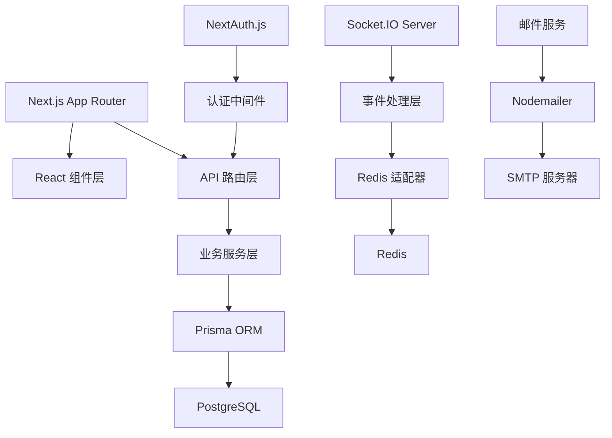

# Chat App - 技术架构

## 项目类型

Chat App 是一个基于 Web 的实时聊天应用，采用现代化的全栈 JavaScript/TypeScript 技术栈。项目专注于提供高性能、低延迟的即时通讯体验，包含实时消息系统、用户管理、消息存储和多媒体处理等核心组件。

## 核心技术栈

### 主要编程语言

- **TypeScript 5.x** - 主要开发语言，提供类型安全和现代 JavaScript 特性
- **JavaScript (ESNext)** - 运行时环境和部分配置文件
- **SQL** - 数据库查询和迁移脚本

### 运行时和编译工具

- **Node.js 20+** - 服务器端运行时环境
- **Next.js 15.5.3** - React 全栈框架，支持 App Router 和服务器端渲染
- **TSX** - TypeScript 执行器，用于开发环境
- **ESBuild** - 高性能构建工具，用于生产环境打包

### 关键依赖和框架

#### 前端框架和 UI
- **React 19.2.0** - 用户界面库，支持最新的并发特性
- **React DOM 19.2.0** - React 的 DOM 渲染器
- **Tailwind CSS 4.x** - 原子化 CSS 框架
- **Radix UI** - 无障碍 UI 组件库 (Accordion, Alert Dialog, Avatar, Checkbox, Dialog, Dropdown Menu, Label, Select, Separator, Slider, Switch, Tabs, Tooltip 等)
- **shadcn/ui 3.3.1** - UI 组件生成器和组件库
- **Lucide React 0.544.0** - 图标库
- **Next Themes 0.4.6** - 主题切换支持
- **class-variance-authority 0.7.1** - CSS 类变体工具
- **clsx 2.1.1** + **tailwind-merge 3.3.1** - CSS 类名合并工具

#### 认证和会话管理
- **NextAuth.js 5.0.0-beta.29** - 现代化认证解决方案
- **@auth/prisma-adapter 2.10.0** - Prisma 数据库适配器
- **Argon2 0.44.0** - 密码哈希算法
- **Jose 6.1.0** - JWT 处理库

#### 实时通信
- **Socket.IO 4.8.1** - 实时双向通信库
- **Socket.IO Client 4.8.1** - 客户端 Socket.IO 库
- **@socket.io/admin-ui 0.5.1** - Socket.IO 管理界面
- **@socket.io/redis-adapter 8.3.0** - Redis 适配器，支持多实例部署

#### 数据库和 ORM
- **Prisma 6.16.2** - 现代化 ORM 和数据库工具链
- **@prisma/client 6.16.2** - Prisma 客户端
- **PostgreSQL** - 主要关系型数据库
- **Redis 5.8.2** - 缓存和 Socket.IO 适配器存储

#### 表单和验证
- **React Hook Form 7.62.0** - 高性能表单库
- **@hookform/resolvers 5.2.2** - 表单验证解析器
- **Zod 4.1.9** - TypeScript 优先的模式验证库

#### 邮件服务
- **Nodemailer** - SMTP 邮件发送库

#### 开发和构建工具
- **ESLint 9.x** - 代码质量检查
- **Nodemon 3.1.10** - 开发环境自动重启
- **TSX 4.20.6** - TypeScript 执行器
- **ESBuild 0.25.10** - 高性能构建工具
- **Husky 9.1.7** - Git hooks 管理

## 应用架构

### 架构模式
Chat App 采用 **专为实时通讯优化的全栈架构**，结合了以下设计模式：

- **消息驱动架构**: 以实时消息传输为核心的事件驱动设计
- **模块化设计**: 按聊天功能域组织 (用户管理、消息处理、群组管理)
- **实时通信优先**: Socket.IO + WebSocket 保证低延迟消息传输
- **状态管理**: 集中式的用户状态和消息状态管理

### 核心架构组件

## 数据存储架构

### 主要数据存储

- **PostgreSQL** - 主要关系型数据库
  - 用户账户、好友关系、群组信息
  - 聊天消息历史、文件元数据
  - ACID 事务支持，确保消息一致性和顺序
  
  **好友关系模型与索引策略** (✅ 已完整实现 - 数据层 + API 层完成):
  - `FriendRelation` 表：存储好友关系（有向行，状态：PENDING/ACCEPTED/DECLINED）
    - 字段：id (cuid), userId, friendId, status (FriendStatus enum), createdAt, updatedAt
    - 唯一索引：`@@unique([userId, friendId])` 防止重复请求
    - 复合索引：`@@index([userId, status])`, `@@index([friendId, status])`, `@@index([userId, friendId, status])` 优化查询
    - 级联删除：`onDelete: Cascade` 用户删除时自动清理所有关系记录
    - 表名映射：`@@map("friend_relations")`
  
  - `BlockRelation` 表：存储拉黑关系（单向行）
    - 字段：id (cuid), blockerId, blockedId, createdAt
    - 唯一索引：`@@unique([blockerId, blockedId])` 防止重复拉黑
    - 索引：`@@index([blockerId])`, `@@index([blockedId])` 优化双向查询
    - 级联删除：`onDelete: Cascade`
    - 表名映射：`@@map("block_relations")`
  
  - `FriendStatus` 枚举：ACCEPTED, DECLINED, PENDING
  - 已应用迁移：`20250930105436_add_friend_relations/migration.sql`
  
  **好友系统 API 实现状态** (✅ 已完成 10 个端点):
  - ✅ 好友列表查询 (`GET /api/friends`) - 双向关系查询、分页、排序
  - ✅ 发送好友请求 (`POST /api/friends/requests`) - 去重验证、拉黑检测
  - ✅ 响应请求 (`PATCH /api/friends/requests/[requestId]`) - 接受/拒绝权限验证
  - ✅ 撤回请求 (`DELETE /api/friends/requests/[requestId]`) - 发起方权限验证
  - ✅ 待处理请求列表 (`GET /api/friends/pending`) - 收到/发送双向查询
  - ✅ 删除好友 (`DELETE /api/friends/[friendId]`) - 双向关系删除
  - ✅ 拉黑用户 (`POST /api/friends/block/[userId]`) - 事务级联删除好友关系
  - ✅ 取消拉黑 (`DELETE /api/friends/block/[userId]`) - 单向关系删除
  - ✅ 黑名单列表 (`GET /api/friends/block`) - 分页、搜索支持
  - ✅ 用户搜索 (`GET /api/friends/search`) - 邮箱精确/昵称模糊、关系状态标注
  - ✅ 在线状态查询 (`POST /api/friends/online-status`) - Redis MGET 批量查询（最多 100 用户）

### 缓存和会话存储

- **Redis** - 高性能内存数据库
  - Socket.IO 适配器存储 (支持水平扩展)
  - 用户在线状态缓存和会话管理
  - 消息队列和实时通知系统

### 数据格式

- **JSON** - API 数据交换格式
- **TypeScript 接口** - 类型安全的数据结构定义
- **Prisma Schema** - 数据库模式定义语言

## 外部集成

### API 和协议

- **HTTP/HTTPS** - RESTful API 通信
- **WebSocket** - 实时双向通信协议
- **SMTP** - 邮件发送协议

### 认证集成

- **NextAuth.js** - 统一认证框架
  - Credentials Provider (邮箱密码登录)
  - Email Provider (邮箱验证)
  - 支持多种 OAuth 提供商扩展

### 监控和管理

- **Socket.IO Admin UI** - 实时连接监控
- **Prisma Studio** - 数据库可视化管理
- **Docker Compose** - 本地开发环境编排

## 实时通信架构

### Socket.IO 配置

- **传输方式**: 强制使用 WebSocket (禁用轮询)
- **跨域支持**: 配置 CORS 策略
- **连接恢复**: 自动连接状态恢复机制
- **事件系统**: 类型安全的事件定义和处理

### 消息传递模式

- **点对点通信**: 用户间直接消息传递
- **广播通信**: 全局事件广播
- **房间机制**: 基于房间的消息分组
- **事件确认**: 消息送达确认机制

## 开发环境和工具链

### 构建和开发工具

- **构建系统**: Next.js 内置构建系统 + ESBuild
- **包管理**: NPM 生态系统
- **开发工作流**: 
  - 热重载 (Next.js Fast Refresh)
  - 实时类型检查 (TypeScript)
  - 自动重启 (Nodemon)

### 代码质量工具

- **静态分析**: ESLint 9.x 配置
- **代码格式化**: 集成在 ESLint 配置中
- **类型检查**: TypeScript 编译时检查
- **数据库迁移**: Prisma Migrate

### 版本控制和协作

- **版本控制**: Git
- **分支策略**: 基于功能分支的开发流程
- **代码审查**: Pull Request 工作流

### 开发环境支持

- **热重载**: Next.js Turbopack 支持
- **端口管理**: 可配置的开发服务器端口
- **多实例支持**: Redis 适配器支持多开发实例

## 部署和分发

### 目标平台

- **生产环境**: Linux 服务器 (Docker 容器化)
- **开发环境**: macOS/Linux/Windows (跨平台支持)
- **云平台**: 支持 Vercel、AWS、GCP 等平台部署

### 分发方式

- **容器化部署**: Docker + Docker Compose
- **静态资源**: Next.js 静态导出支持
- **数据库迁移**: Prisma 自动迁移
- **环境配置**: 环境变量配置管理

### 安装要求

- **Node.js**: 20.x 或更高版本 (当前使用 24.x)
- **数据库**: PostgreSQL 12+ 
- **缓存**: Redis 6+
- **内存**: 最少 512MB RAM (推荐 1GB+)
- **磁盘**: 最少 1GB 可用空间
- **包管理器**: NPM (推荐) 或 Yarn/PNPM

## 技术要求和约束

### 性能要求

- **API 响应时间**: < 200ms (95th percentile)
- **实时消息延迟**: < 100ms
- **并发连接**: 支持 1000+ WebSocket 连接
- **数据库查询**: 复杂查询 < 500ms
- **内存使用**: < 1GB (正常负载)

### 兼容性要求

- **浏览器支持**: 现代浏览器 (Chrome 90+, Firefox 88+, Safari 14+)
- **Node.js 版本**: 20.x LTS
- **数据库版本**: PostgreSQL 12+, Redis 6+
- **TypeScript 版本**: 5.x

### 安全和合规

#### 安全要求

- **密码安全**: Argon2 哈希算法
- **会话管理**: JWT + 安全 Cookie
- **数据传输**: HTTPS 强制加密
- **输入验证**: Zod 模式验证
- **SQL 注入防护**: Prisma ORM 参数化查询

#### 威胁模型

- **认证绕过**: 多层验证机制
- **会话劫持**: 安全 Cookie 配置
- **数据泄露**: 最小权限原则
- **拒绝服务**: 连接限制和速率限制

### 可扩展性和可靠性

#### 预期负载

- **用户规模**: 1000+ 注册用户
- **并发连接**: 100+ 同时在线用户
- **消息吞吐**: 1000+ 消息/分钟
- **数据增长**: 10GB+/年

#### 可用性要求

- **目标可用性**: 99.5%
- **灾难恢复**: 数据库备份策略
- **故障转移**: Redis 集群支持

#### 增长预期

- **水平扩展**: Socket.IO 集群支持
- **数据库扩展**: 读写分离、连接池
- **缓存扩展**: Redis 集群

## 技术决策和理由

### 架构决策记录

#### 1. **Next.js App Router vs Pages Router**
- **选择**: App Router (Next.js 13+)
- **理由**: 
  - 更好的开发体验和性能
  - 服务器组件支持
  - 改进的路由和布局系统
- **权衡**: 学习曲线，但长期收益更大

#### 2. **Socket.IO vs 原生 WebSocket**
- **选择**: Socket.IO 4.8.1
- **理由**:
  - 自动重连和连接恢复
  - 房间和命名空间管理
  - 跨浏览器兼容性
  - 丰富的生态系统 (Redis 适配器、Admin UI)
- **权衡**: 额外的库依赖，但功能完整性更好

#### 3. **Prisma vs 其他 ORM**
- **选择**: Prisma 6.16.2
- **理由**:
  - 类型安全的数据库访问
  - 优秀的开发体验 (Studio, Migrate)
  - 强大的查询构建器
  - NextAuth.js 官方适配器支持
- **权衡**: 相对较新，但生态系统成熟

#### 4. **PostgreSQL vs MongoDB**
- **选择**: PostgreSQL
- **理由**:
  - 强一致性和 ACID 事务
  - 丰富的数据类型支持
  - 成熟的生态系统
  - Prisma 优秀支持
- **权衡**: 关系型约束，但数据完整性更好

#### 5. **TypeScript vs JavaScript**
- **选择**: TypeScript 5.x
- **理由**:
  - 编译时类型检查
  - 更好的 IDE 支持
  - 大型项目维护性
  - 与 React 和 Next.js 的完美集成
- **权衡**: 编译开销，但开发效率提升显著

## 已知限制和改进计划

### 当前技术债务

#### 1. **聊天功能缺失**
- **限制**: 核心聊天功能尚未实现
- **影响**: 产品主要功能缺失
- **计划**: 实施消息组件、存储和实时传输系统

#### 2. **实时通信可靠性**
- **限制**: 基础事件传输，缺少消息确认机制
- **影响**: 可靠性有待增强
- **计划**: 实施消息确认和重传机制

#### 3. **并发性能瓶颈**
- **限制**: 单实例部署限制并发能力
- **影响**: 高负载时性能下降
- **计划**: 实施 Socket.IO 集群和负载均衡

#### 4. **中间件系统改进**
- **限制**: ~~Socket.IO 仅有日志中间件，缺少认证中间件~~ → ✅ 已解决
- **影响**: ~~Socket 连接安全性不足~~ → ✅ 已加强
- **计划**: ~~补充 Socket.IO 认证中间件~~、速率限制、错误处理中间件
- **进展**: 
  - ✅ API 路由中间件系统完善（每个路由有独立的 middleware.ts，使用 Zod 验证）
  - ✅ user-relations API 已实现完整的输入验证和错误处理
  - ✅ **Socket.IO 认证中间件已实现**（`src/socket/server/middleware/auth.ts`）
    - ✅ 从 handshake 获取 NextAuth JWT token
    - ✅ 验证 token 有效性
    - ✅ 提取 userId 和 username 附加到 socket.data
    - ✅ 自动将用户加入个人房间（userId）
    - ✅ 未认证用户拒绝连接并返回清晰错误
  - 📋 待实施速率限制（已规划）：
    - 发送好友请求：10 次/分钟
    - 用户搜索：5 次/10 秒
    - 接受/拒绝请求：20 次/分钟
  - 📋 待实施审计日志：记录所有好友关系变更操作（userId, action, targetUserId, metadata）

#### 5. **监控和观测性**
- **限制**: 缺少全面的系统监控
- **影响**: 问题诊断困难
- **计划**: 集成 APM 工具、结构化日志、性能指标

### 技术演进路线图

#### 短期改进 (1-3个月)
- 🚧 实施好友系统 (user-relations 规格中 - 后端完成，前端基础就绪 13/19，68.4%)
  - ✅ 数据模型和迁移完成 (tasks 1-2)
    - ✅ Prisma schema (FriendRelation, BlockRelation 模型)
    - ✅ TypeScript 类型定义（`src/types/friend/` 目录，共享类型系统优化）
  - ✅ API 层实施完成 (tasks 3-10，10个端点)
    - ✅ 好友请求发送/响应/撤回 (tasks 3-4)
    - ✅ 好友列表查询和待处理请求 (tasks 5-6)
    - ✅ 好友删除功能 (task 7)
    - ✅ 拉黑管理（拉黑/取消拉黑/黑名单查询）(task 8)
    - ✅ 用户搜索（邮箱精确/昵称模糊，含关系状态）(task 9)
    - ✅ 在线状态批量查询（Redis MGET，最多100用户）(task 10)
    - ✅ 所有端点遵循认证模块架构（route.ts + service.ts + middleware.ts）
  - ✅ Socket.IO 实时事件实施完成 (tasks 11-12)
    - ✅ Socket 认证中间件（从 NextAuth JWT token 认证，自动加入个人房间）
    - ✅ 8个事件处理器（request, accept, decline, remove, block, unblock, online, offline）
    - ✅ 在线状态管理（连接/断开时 Redis SET EX/DEL + 通知所有好友）
    - ✅ Redis 全局单例配置（与 Prisma 架构一致）
    - ✅ 所有 API 端点已集成 Socket 事件推送（数据库操作成功后）
  - ✅ 前端基础页面实施完成 (task 14)
    - ✅ Friends.tsx 主组件（4个 Tab：好友列表、待处理请求、搜索用户、黑名单）
    - ✅ 空状态展示和引导
  - 📋 前端 API 管理器实施 (task 13 - 优先级高，阻塞 task 18)
    - FriendsApiManager 类（继承 BaseApiManager）
    - 12个 API 方法，导出单例 friendsApi
  - 📋 前端具体组件实施 (tasks 15-17)
    - 8个组件：FriendList, FriendListItem, OnlineStatusBadge (task 15)
                PendingRequestsList, FriendRequest (task 16)
                SearchUser, UserSearchResult, BlockList (task 17)
  - 📋 前端 Hooks 实施 (task 18 - 依赖 task 13)
    - 4个 Hooks：useFriendsList, usePendingRequests, useOnlineStatus, useSearchUsers
  - 📋 端到端测试和优化 (task 19)
- 📋 完成好友系统前端剩余任务 (tasks 13, 15-19)
- 📋 实施核心聊天功能 (消息组件、存储、实时传输)
- ✅ ~~完善 Socket 认证中间件~~ → 已完成（包含 NextAuth JWT 验证、房间管理）
- 📋 实施速率限制和审计日志系统
- 📋 加强错误处理和日志记录

#### 中期改进 (3-6个月)
- 实施 Socket.IO 集群部署
- 添加全链路监控和追踪
- 优化前端性能 (代码分割、懒加载)
- 实施自动化测试策略

#### 长期改进 (6-12个月)
- 微服务架构重构
- 实施 CI/CD 流水线
- 添加移动端支持
- 集成第三方服务 (推送通知、文件存储)

---

## Evidence (证据来源)

### 技术栈配置文件
- **依赖管理**: `package.json` - 完整的依赖清单和脚本配置
  - React 19.2.0, Next.js 15.5.4, Socket.IO 4.8.1
  - @types/node 24.6.2, Prisma 6.16.3, Redis 5.8.2
- **TypeScript 配置**: `tsconfig.json` - 编译选项和路径映射
- **Next.js 配置**: `next.config.ts` - 框架配置和优化选项
- **ESLint 配置**: `eslint.config.mjs` - 代码质量规则
- **规格工作流**: `.spec-workflow/templates/` - 文档模板系统（6个标准模板）

### 数据库和 ORM
- **Prisma Schema**: `prisma/schema.prisma` - 数据模型定义
  - User, Account, Session, VerificationToken (认证)
  - FriendRelation, BlockRelation (好友系统 - ✅ 已完整实现)
  - FriendStatus 枚举 (ACCEPTED, DECLINED, PENDING)
- **数据库迁移**: `prisma/migrations/` - 迁移历史和版本控制
  - 20250830081916_init - 初始化
  - 20250902153748_init - 二次初始化
  - 20250917123034_add_user_fields_and_profile - 用户字段扩展
  - 20250930105436_add_friend_relations - 好友关系模型（✅ 已应用）
- **Docker 配置**: `docker-compose.yml` - PostgreSQL 和 Redis 服务配置
- **类型系统优化**: 
  - `src/types/auth/common.ts` - 共享认证 schemas (emailSchema, passwordConfirmSchema)
  - `src/types/common.ts` - 通用工具 (paginationSchema, emptySchema, createApiSchema)
  - `src/types/friend/*.ts` - 完整的好友系统类型（13 个文件，含 search-user, online-status 新增类型）

### 实时通信实现
- **Socket.IO 服务器**: `src/socket/server/config.ts` - 服务器配置和初始化
- **中间件系统**: 
  - `src/socket/server/middleware/logging.ts` - 事件日志和监控
  - `src/socket/server/middleware/auth.ts` - NextAuth JWT token 认证（✅ 已实现）
- **事件处理**: 
  - `src/socket/server/events/connection/` - 连接管理和在线状态
  - `src/socket/server/events/remote/` - 远程控制事件
  - `src/socket/server/events/friend/` - 好友系统事件（✅ 6个处理器已实现）
- **客户端配置**: `src/socket/client/config.ts` - 客户端连接配置和会话集成
- **Redis 适配器**: `src/socket/server/adapter.ts` - 多实例支持配置
- **Redis 配置**: `src/lib/config/redis.ts` - 全局单例客户端（✅ 已实现）

### 认证系统
- **NextAuth 配置**: `src/lib/config/next.auth.ts` - 认证提供商和回调配置
- **密码加密**: `src/lib/crypto.ts` - Argon2 实现
- **邮件服务**: `src/lib/email.ts` - Nodemailer 配置

### API 和路由
- **认证 API**: `src/app/api/auth/` - 登录、注册、密码重置 API
- **好友管理 API**: `src/app/api/friends/` - 好友系统完整 API (✅ 10个端点已实现)
  - GET `/api/friends` - 好友列表查询（分页、排序）
  - POST `/api/friends/requests` - 发送好友请求
  - PATCH/DELETE `/api/friends/requests/[requestId]` - 响应/撤回请求
  - GET `/api/friends/pending` - 待处理请求列表
  - DELETE `/api/friends/[friendId]` - 删除好友
  - POST/DELETE `/api/friends/block/[userId]` - 拉黑/取消拉黑用户
  - GET `/api/friends/block` - 黑名单列表
  - GET `/api/friends/search` - 用户搜索（邮箱/昵称精确/模糊搜索）
  - POST `/api/friends/online-status` - 批量在线状态查询（Redis）
- **页面路由**: `src/app/(auth)/`, `src/app/(dashboard)/` - 应用页面结构
- **中间件**: `src/app/api/*/middleware.ts` - 统一的路由级中间件（Zod 验证 + 错误处理）

### UI 和组件
- **基础组件**: `src/components/ui/` - Radix UI 和 shadcn/ui 组件 (40+ 组件)
  - 包括：accordion, alert-dialog, avatar, badge, button, card, checkbox, dialog, dropdown-menu, form, input, label, select, separator, sidebar, table, tabs, tooltip 等
  - 特殊组件：`shadcn-io/navbar-01/`, `shadcn-io/android/`
- **业务组件**: `src/components/my-ui/` - 自定义业务组件
  - AppSidebar, AuthCard, AuthNavSection, Form, FormField, ModeToggle, Navbar, SiteHeader
- **页面组件**: `src/components/pages/` - 页面级组件
  - Login, Register, ForgotPassword, ResetPassword, RemoteControl, Socket
- **Hooks**: `src/hooks/` - useForm.ts, use-mobile.ts
  - 📋 待实施好友系统 Hooks: useFriendsList, usePendingRequests, useOnlineStatus, useSearchUsers
- **样式配置**: `postcss.config.mjs` (Tailwind CSS 4.x PostCSS 配置)

### 构建和部署
- **构建脚本**: `package.json` scripts - 开发和生产构建配置
  - `dev`: 使用 nodemon + tsx + turbopack 热重载开发
  - `build`: ESBuild 打包服务器 + Next.js 构建
  - `start`: 生产环境启动 (NODE_ENV=production)
  - `db:init`, `db:migrate`, `db:studio`: Prisma 数据库工具
  - `prepare`: Husky Git hooks 初始化
- **Docker 配置**: `Dockerfile`, `docker-entrypoint.sh` - 容器化配置
- **环境变量**: `.env.sample` - 环境配置模板
- **Git Hooks**: `.husky/` - pre-commit 钩子配置
- **CI/CD**: `.github/workflows/ci.yml` - 持续集成配置
